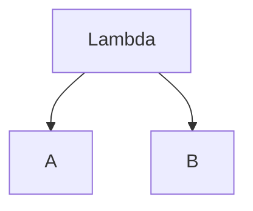

# Introduction

In this post I want to break down the parts of the CHSH inequality. It is relevant to my interest in the foundations of Quantum Mechanics. A lot of people have argued over this result (and similar results such as Bell's inequality) in language that I don't understand (e.g. "realism", "locality", "free choice"). This is my attempt to make some sense of the mathematics *prior* to applying intuitions or philosophical principles to it.

# Preamble

In this section I'll describe the setup and what assumptions I am (knowingly) making.

## Random Variables
First let us assume there exists three random variables $A(\gamma, \Lambda (\omega), \omega)$, $B(\eta, \Lambda (\omega), \omega)$, and $\Lambda (\omega)$ on a probability space $(\Omega, \mathcal{F}, P)$. The (deterministic) variables $\gamma \in S_{\gamma}$ and $\eta \in S_{\eta}$ represent different detector  that respectively influence the measurements $A$ and $B$. The [image](https://en.wikipedia.org/wiki/Image_(mathematics)) of $A$ and $B$ are the set $$\{ -1, 0, 1 \} .$$

Notice that $A$ and $B$ are functions of $\Lambda$.

## Distributions

I assume then that these random variables have derived distributions from $P$

$$A \sim F_{A}$$

$$B \sim F_{B}$$

$$\Lambda \sim F_{\Lambda}$$

which are unknown. Their joint distribution $$(A, B, \Lambda) \sim F_{A, B, \Lambda}$$ is also unknown.

# Expectation

Partly to challenge myself, and partly to see if the assumption matters, I will **not** assume that $F_{\Lambda}$ is smooth. We will need to consider moments, which for a random variable $X \sim F_X$ can be calculated for the $k$th moment (if it exists) using

$$\frac{1}{k} \mathbb{E}[X^k] = \int_{0}^{\infty} x^{k-1} (1 - F_X(x)) dx - \int_{-\infty}^{0} x^{k-1}F_X(x) dx$$

for which we are interesed in 

$$\mathbb{E}[X] = \int_{0}^{\infty} (1 - F_X(x)) dx - \int_{-\infty}^{0} F_X(x) dx$$

as a particular case.

For brevity I will abbreviate the expectation

$$\mathbb{E}_{F_{\Lambda}}[A(\gamma, \Lambda (\omega), \omega) B(\eta, \Lambda (\omega), \omega)]$$

to 

$$\mathbb{E}[A(\gamma, \Lambda ) B(\eta, \Lambda )]$$

since we will always be integrating over the distribution of $\Lambda$ and we know that the random variables share some underlying outcome space $\Omega$.
