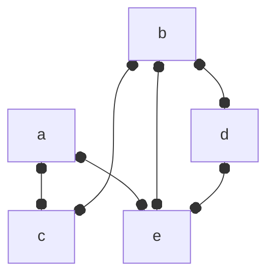
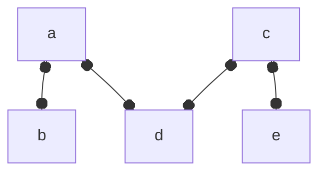
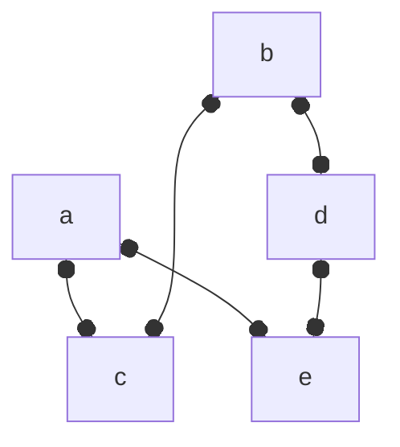
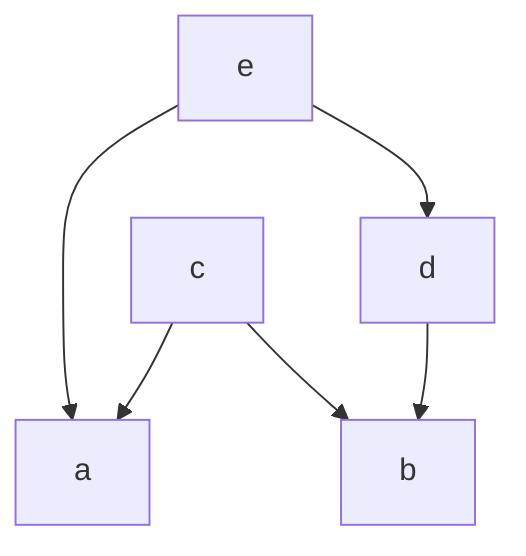

# Fundamentals

## Essential Definitions and Examples

> **Definition**
> A partial order is a pair $(X, \leq)$ composed of a set $X$ called the ground set and $\leq$ is a binary relation with the following relation:
- reflexivity: $x \leq x\ \forall x \in X$
- transitivity: $x \leq y \land y \leq z \implies x \leq z\  \forall x,y,z \in X$
- antisymmtry: $x \leq y \land y \leq x \implies x = y\  \forall x,y \in X$

Let us consider an example of a partial order and some of the ways we can represent them.

> **Example**
> Let $X = \{a, b, c, d, e \}$, then we might have a partial order $\{aa, ac, ae, bb, bc, bd, be, cc, dd, de, ee\}$. This partial order can be represented as a matrix.
>
> $$\begin{array}{c c} &
\begin{array}{c c c c c} a & b & c & d & e \\
\end{array}
\\
\begin{array}{c c c c c}
a \\
b \\
c \\
d \\
e \\
\end{array}
&
\left[
\begin{array}{c c c c c}
1 & 0 & 1 & 0 & 1 \\
 & 1 & 1 & 1 & 1 \\
 &  & 1 & 0 & 0 \\
 & \huge 0 &  & 1 & 1 \\
 &  &  &  & 1 \\
\end{array}
\right]
\end{array}
$$
> 
Another representation is a directed graph (AKA a digraph):
> 

> The previous example only required a relatively small subset of the Cartesian $X \times X$. When you a have too many elements in $X$ to deal with by hand, one quick Python script to make the pairs in a format suitable for $\LaTeX$ is the following:
```python
from itertools import product
X = 'a', 'b', 'c', 'd', 'e'
XxX = [''.join(i) for i in product(X,X)]
XxX = sorted(XxX)
XxX = str(XxX).replace("'", "")
XxX = XxX.replace("[", "\\{")
XxX = XxX.replace("]", "\\}")
print(XxX)
```
This will print `\{aa, ab, ac, ad, ae, ba, bb, bc, bd, be, ca, cb, cc, cd, ce, da, db, dc, dd, de, ea, eb, ec, ed, ee\}`.
{: .prompt-tip}

> The digraph diagram in the previous example can be made with the following snippet of code:
```python
from graphviz import Digraph
XxX = 'aa', 'ac', 'ae', 'bb', 'bc', 'bd', 'be', 'cc', 'dd', 'de', 'ee'
D = Digraph('example_partial_order')
for xx in XxX:
    D.edge(xx[0], xx[1])
D.view()
```
> This will produce a portable document formatted file named `example_partial_order.gv.pdf`.
{: .prompt-tip}


> **Definition**
> A strict partial order is a pair $(X, <)$ composed of a set $X$ called the ground set and $<$ is a binary relation with the following relation:
- transitivity: $x < y \land y < z \implies x < z\  \forall x,y,z \in X$
- asymmetry: $\lnot (x < y \land y < x) \  \forall x,y \in X$

> **Proposition** The digraph representation of a strict order is a directed acyclic graph (DAG).

Often we can start with a strict order and derive similar results for a corresponding (non-strict) partial order.

> **Definition** $\{x,  y\}$ are a comparable pair if $x < y \lor y > x$, denoted $x \sim y$.

> **Definition** A graph $G = (V, E)$ whose edge set $E$ is the set of comparable pairs of a partial order is called the comparability graph.

> **Example** Suppose we have the strict partial order $\{ ac, ae, bc, bd, be, de\}$, then its comparability graph would look like:


> **Definition** $\{x,  y\}$ are an incomparable pair if $\lnot (x < y \lor y > x)$, denoted $x \parallel y$.

> **Definition** A graph $G = (V, E)$ whose edge set $E$ is the set of incomparable pairs of a partial order is called the comparability graph.

> **Example** Suppose we have the strict partial order $\{ ac, ae, bc, bd, be, de\}$, then its incomparability graph (AKA cocomparability graph) would look like:


> **Proposition** The edge set of an incomparability graph is the complement of the edge set of the comparability graph.

> **Definition** A cover relation $x \prec y$ is satisfied when $x < y$ and there does not exist $z$ such that $x < z < y$.

> **Definition** A graph $G = (V, E)$ is a cover graph when its edge set $E$ is a collection of pairs satisfying a cover relation.

> **Example** Suppose we have the strict partial order $\{ ac, ae, bc, bd, be, de\}$, then its cover graph would look like:


> **Definition** A directed graph $D = (V, E)$ is a directed cover graph when its edge set $E$ is a collection of pairs satisfying a cover relation and the order of the pairs is represented with arcs.

> **Example** Suppose we have the strict partial order $\{ ac, ae, bc, bd, be, de\}$, then its directed cover graph would look like:



> **Definition** A cover diagram is a drawing of the directed graph representing a cover relation such that the edges are cover pairs $(x,y)$. Edges are drawn in such a way that $x$ is below $y$ (in the graph embedding) ad the edge is $y$-monotone.

> **Example** Suppose we have the strict partial order $\{ ac, ae, bc, bd, be, de\}$, then its cover diagram would look like:


> The previous example was plotted using the following Python script:
```python
import matplotlib.pyplot as plt
import networkx as nx
g = nx.Graph()
g.add_edge('a', 'c')
g.add_edge('a', 'e')
g.add_edge('b', 'c')
g.add_edge('b', 'd')
g.add_edge('d', 'e')
pos = {'a':(0,1),
       'b':(1,0),
       'c':(0,3),
       'd':(2,2),
       'e':(1,4)}
nx.draw(g, pos=pos, labels={i:i for i in g.nodes()}, node_color=(0.5,)*3)
plt.savefig('example_cover_relation_diagram.png', dpi=300, transparent=True)
plt.close()
```
