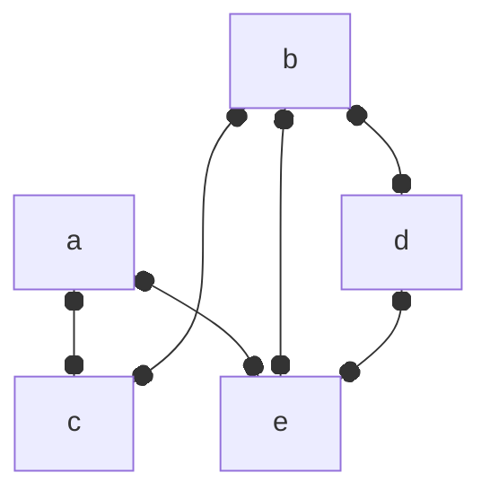
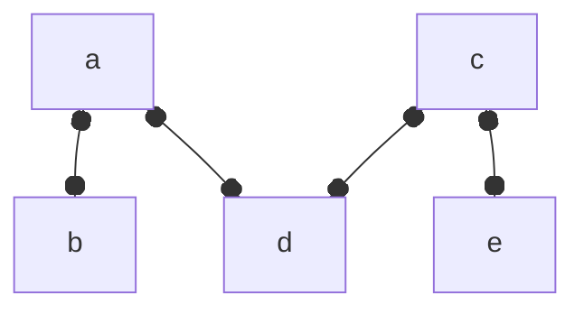
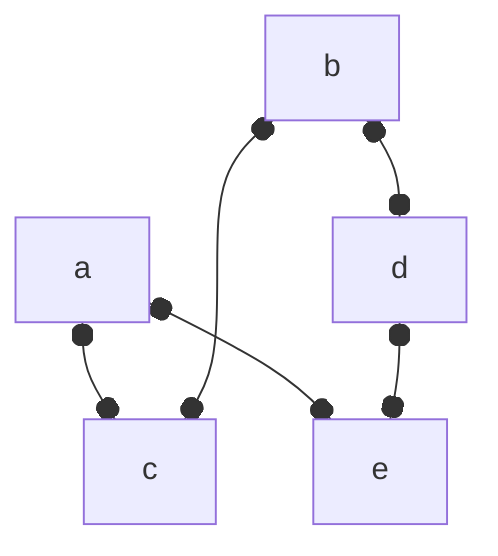
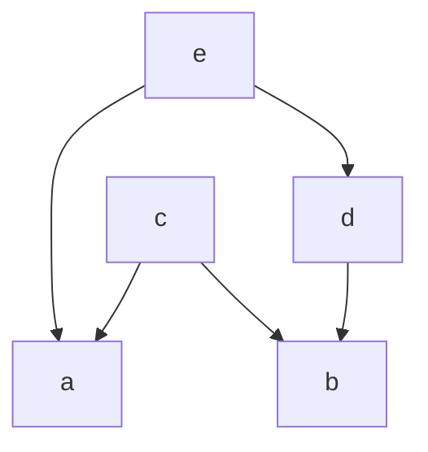

# Fundamentals

## Essential Definitions and Examples

> **Definition**
> A partial order is a pair $(X, \leq)$ composed of a set $X$ called the ground set and $\leq$ is a binary relation with the following relation:
- reflexivity: $x \leq x\ \forall x \in X$
- transitivity: $x \leq y \land y \leq z \implies x \leq z\  \forall x,y,z \in X$
- antisymmtry: $x \leq y \land y \leq x \implies x = y\  \forall x,y \in X$

Let us consider an example of a partial order and some of the ways we can represent them.

> **Example**
> Let $X = \{a, b, c, d, e \}$, then we might have a partial order $\\{(a,a), (a,c), (a,e), (b,b), (b,c), (b,d), (b,e), (c,c), (d,d), (d,e), (e,e)\\}$. This partial order can be represented as a matrix.
>
> $$\begin{array}{c c} &
\begin{array}{c c c c c} a & b & c & d & e \\
\end{array}
\\
\begin{array}{c c c c c}
a \\
b \\
c \\
d \\
e \\
\end{array}
&
\left[
\begin{array}{c c c c c}
1 & 0 & 1 & 0 & 1 \\
 & 1 & 1 & 1 & 1 \\
 &  & 1 & 0 & 0 \\
 & \huge 0 &  & 1 & 1 \\
 &  &  &  & 1 \\
\end{array}
\right]
\end{array}
$$
> 
Another representation is a directed graph (AKA a digraph):
> 

> The previous example only required a relatively small subset of the Cartesian $X \times X$. When you a have too many elements in $X$ to deal with by hand, one quick Python script to make the pairs in a format suitable for $\LaTeX$ is the following:
```python
from itertools import product
X = 'a', 'b', 'c', 'd', 'e'
XxX = ['('+', '.join(i) + ')' for i in product(X,X)]
XxX = sorted(XxX)
XxX = str(XxX).replace("'", "")
XxX = XxX.replace("[", "\\\\{")
XxX = XxX.replace("]", "\\\\}")
print(XxX)
```
This will print `\\{(a, a), (a, b), (a, c), (a, d), (a, e), (b, a), (b, b), (b, c), (b, d), (b, e), (c, a), (c, b), (c, c), (c, d), (c, e), (d, a), (d, b), (d, c), (d, d), (d, e), (e, a), (e, b), (e, c), (e, d), (e, e)\\}`.
{: .prompt-tip}

> The digraph diagram in the previous example can be made with the following snippet of code:
```python
from graphviz import Digraph
XxX = 'aa', 'ac', 'ae', 'bb', 'bc', 'bd', 'be', 'cc', 'dd', 'de', 'ee'
D = Digraph('example_partial_order')
for xx in XxX:
    D.edge(xx[0], xx[1])
D.view()
```
> This will produce a portable document formatted file named `example_partial_order.gv.pdf`.
{: .prompt-tip}


> **Definition**
> A strict partial order is a pair $(X, <)$ composed of a set $X$ called the ground set and $<$ is a binary relation with the following relation:
- transitivity: $x < y \land y < z \implies x < z\  \forall x,y,z \in X$
- asymmetry: $\lnot (x < y \land y < x) \  \forall x,y \in X$

> **Proposition** The digraph representation of a strict order is a directed acyclic graph (DAG).

Often we can start with a strict order and derive similar results for a corresponding (non-strict) partial order.

> **Definition** $\{x,  y\}$ are a comparable pair if $x < y \lor y > x$, denoted $x \sim y$.

> **Definition** A graph $G = (V, E)$ whose edge set $E$ is the set of comparable pairs of a partial order is called the comparability graph.

> **Example** Suppose we have the strict partial order $\\{(a,c), (a,e), (b,c), (b,d), (b,e), (d,e)\\}$, then its comparability graph would look like:


> **Definition** $\{x,  y\}$ are an incomparable pair if $\lnot (x < y \lor y > x)$, denoted $x \parallel y$.

> **Definition** A graph $G = (V, E)$ whose edge set $E$ is the set of incomparable pairs of a partial order is called the comparability graph.

> **Example** Suppose we have the strict partial order $\\{(a,c), (a,e), (b,c), (b,d), (b,e), (d,e)\\}$, then its incomparability graph (AKA cocomparability graph) would look like:


> **Proposition** The edge set of an incomparability graph is the complement of the edge set of the comparability graph.

> **Definition** A cover relation $x \prec y$ is satisfied when $x < y$ and there does not exist $z$ such that $x < z < y$.

> **Definition** A graph $G = (V, E)$ is a cover graph when its edge set $E$ is a collection of pairs satisfying a cover relation.

> **Example** Suppose we have the strict partial order $\\{(a,c), (a,e), (b,c), (b,d), (b,e), (d,e)\\}$, then its cover graph would look like:


> **Definition** A directed graph $D = (V, E)$ is a directed cover graph when its edge set $E$ is a collection of pairs satisfying a cover relation and the order of the pairs is represented with arcs.

> **Example** Suppose we have the strict partial order $\\{(a,c), (a,e), (b,c), (b,d), (b,e), (d,e)\\}$, then its directed cover graph would look like:



> **Definition** A cover diagram is a drawing of the directed graph representing a cover relation such that the edges are cover pairs $(x,y)$. Edges are drawn in such a way that $x$ is below $y$ (in the graph embedding) ad the edge is $y$-monotone.

> **Example** Suppose we have the strict partial order $\\{(a,c), (a,e), (b,c), (b,d), (b,e), (d,e)\\}$, then its cover diagram would look like:


> The previous example can be plotted using the following Python script:
```python
import matplotlib.pyplot as plt
import networkx as nx
g = nx.Graph()
g.add_edge('a', 'c')
g.add_edge('a', 'e')
g.add_edge('b', 'c')
g.add_edge('b', 'd')
g.add_edge('d', 'e')
pos = {'a':(0,1),
       'b':(1,0),
       'c':(0,3),
       'd':(2,2),
       'e':(1,4)}
nx.draw(g, pos=pos, labels={i:i for i in g.nodes()}, node_color=(0.5,)*3)
plt.savefig('example_cover_relation_diagram.png', dpi=300, transparent=True)
plt.close()
```
{: .prompt-tip}

## Special Classes of Orders

- linear orders (aka total orders, aka chains).
  - Important in computer science problems such as sorting.
  - Important in mathematics for defining sets of numbers such as $\mathbb{N}$, $\mathbb{Z}$, $\mathbb{R}$ and others.
- Boolean lattices
  - $B_n = (2^{[n]}, \subseteq )$ where $$[n] = \{ 1, \ldots, n \}$$
  - Looks at subsets of $n$ ordered by inclusion

> **Proposition** The subset relation on any family of sets is an order relation.

> **Example** [Intervals](https://en.wikipedia.org/wiki/Interval_(mathematics)), [discs](https://en.wikipedia.org/wiki/Disk_(mathematics)), [balls](https://en.wikipedia.org/wiki/Ball_(mathematics)), [subtrees](https://mathworld.wolfram.com/Subtree.html), [subgraphs](https://mathworld.wolfram.com/Subgraph.html), [subgroups](https://en.wikipedia.org/wiki/Subgroup) are all included sets under the order relation of set [inclusion](https://en.wikipedia.org/wiki/Inclusion_order).

> **Definition** A containment relation is [...]

> **Definition** For $A \subseteq X$ we have the down-set of $A$ being 
> $$D[A] = \bigcup_{a \in A} D[a] = \{ x | \exists a \in A\ \text{s.t.}\ x \leq a \}$$.

> **Proposition** Every finite order is the containment order of a family of sets.
> 
> **Proof** Let $P = (X, \leq)$ be an order relation.
>
> For $a \in X$ let $D[a] = \{ x : x \leq a \}$ be the down-set of a.
>
> Let $$y = \{ D[a] : a \in X \}$$.
>
> Now we claim that $P \cong (y, \subseteq )$ where $\cong$ is an order-preserving isomorphism.
>
> Since isomorphisms are bijections, we take the bijection in this case to $D : x \mapsto D[x]$.
>
> We need to verify that $D$ as we have just defined it is actually a bijection.
>
> If a mapping is a bijection, then it is both injective and surjective.
>
> Considering the injective case, let take two elements $x$ and $y$ such that $x \neq y$ then there are three possibilities:
> - $x < y \implies y \not\in D[x]$
> - $x > y \implies x \not\in D[y]$
> - $x \parallel y$ (i.e. $x$ and $y$ are not comparable in the order) which implies $(y \not\in D[x]) \land (x \not\in D[y])$
>
> Surjectivity is given by definition of $D$.
>
> And we have that $D$ is order-preserving in the sense that $x \leq y \iff D[x] \subseteq D[y]$.
> $$\blacksquare$$

> **Definition** A lower bound of a subset $S$ of partially ordered set $(P, \leq)$ is an element $a \in P$ such that $a \leq x \forall x \in S$.

> **Definition** A lower bound $a \in S$ is called an infinum (or greatest lower bound, or meet) of $S$ if for all lower bounds $y \in S$ we have $y \leq a$.

> **Definition** An upper bound of a subset $S$ of partially ordered set $(P, \leq)$ is an element $b \in P$ such that $b \geq x \forall x \in S$.

> **Definition** An upper bound $b$ of $S$ is called a supremum (or least upper bound, or join) of $S$ if for all upper bounds $z \in S$ we have $z \leq b$.

> **Definition** A finite poset on $S$ is a lattice if every subset of $S$ has an unique least upper bound (aka join or supremum) denoted $\lor$ and an unique greatest lower bound (aka meet or infinum) denoted $\land$.

> **Definition** The down-set lattice of $P$ given by
> $$D(P) = (\{ D[A] : A \subset X \}, \subseteq)$$.

> **Definition** A lattice $(L, \lor, \land)$ is distributive if the following identity holds for all $x,y,z \in L$:
>
> $$x \land (y \lor z) = (x \land y) \lor (x \land z)$$
>
> where $\land$ and $\lor$ are the [meet and join](https://en.wikipedia.org/wiki/Join_and_meet) operations.

> **Proposition** The down-set lattice of $P$ is a distributive lattice.
>
> **Proof (Hint)** Take $\lor$ to be $\cup$ and $\land$ to be $\cap$.

> **Example**

> **Definition** $Q = (Y, \leq_Q ) $ is a subposet of $P = (X, \leq_P)$ if $Y \subseteq X$ and $(\leq_Q) = (\leq_P) \cap (Y \times Y)$.


# References
- [Lectures: Introduction to Order Theory, Fall 2020](https://www.youtube.com/playlist?list=PL5rqYzyihIQ0nzfnsEKxxedCpbNQoifgg)
- [Introduction to Order Theorie](https://page.math.tu-berlin.de/~felsner/Lehre/dsIII20-21.html)
- [Introduction to order theory](https://piotrmicek.staff.tcs.uj.edu.pl/introduction-to-order-theory-2020/)
- [Infinum and Supremum](https://en.wikipedia.org/wiki/Infimum_and_supremum)
