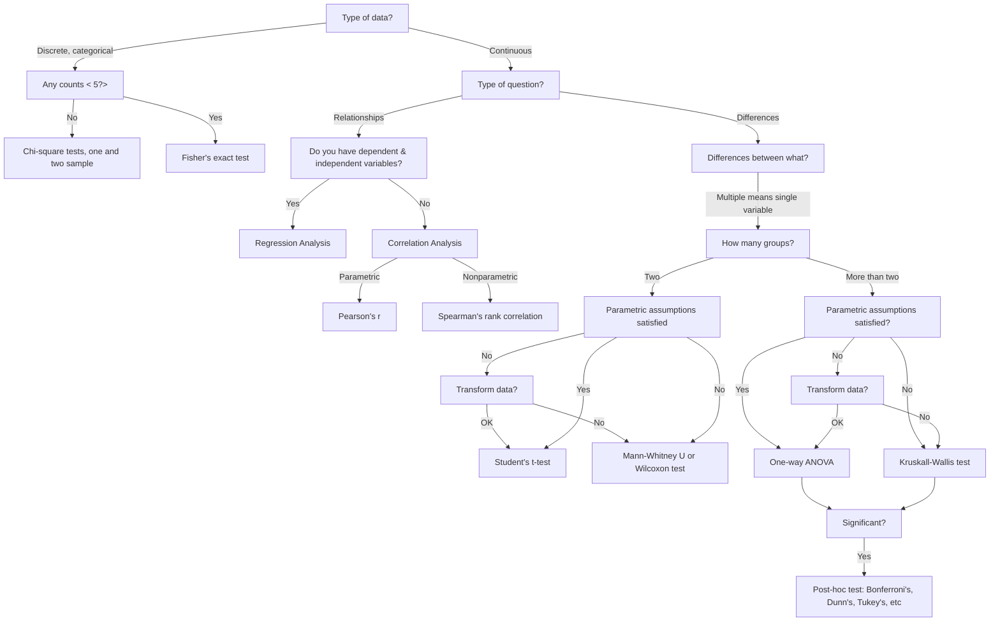

This post was prompted by a statement given in the following video.



Here is the specific statement that this post is a response to:

> **Quotation** (Dustin Fife)
>
> Every time I can think of that you would have a convergence issue there is no rank-based equivalent for that. `[...]` as far as I know there are no rank-based nonparametric tests for mixed models. The original rank-based procedures are modelled after t-tests, ANOVAs, and regressions. `[...]` I don't think there's ever a situation where you're going to have a convergence issue because its a complex model where there's actually going to be a rank-based equivalent for that model.

I recently read [False Equivalence: The Problem with Unreasonable Comparisons](https://effectiviology.com/false-equivalence/) that left me with a sense that equivalence (according to the author, Itamar Shatz) is a subjective opinion about what can and cannot be compared. Maybe such an approach to thinking about equivalence is valuable, but frankly I prefer the tools provided by logic and mathematics. Ideas like [logical equivalence](https://en.wikipedia.org/wiki/Logical_equivalence), [equivalence relations](https://en.wikipedia.org/wiki/Equivalence_relation), [isomorphism](https://en.wikipedia.org/wiki/Isomorphism), and [adjunction](https://en.wikipedia.org/wiki/Adjoint_functors) allows us to consider different notions of "sameness" between things.

I cannot carefully consider this point about equivalence without clarification on what Dustin meant by "equivalent". It is true that at least some of the popularizers of rank-based non-parametric tests explicitly had the intention of using them as a heuristic in lieu of parametric tests such of t-tests or ANOVA.

The idea that rank-based statistics are merely proxies of certain parametric statistics is inaccurate. But before we unpack that, let us consider why many people, possibly Dustin included think this way. After all, there is an inexhaustible supply of  textbooks, tutorials, and internet posts express this point of view.

According to some sources, you can simply consult a flow chart to determine which statistical procedure can be used. Here is such a diagram which I adapated from Richard McElreath's *Statistical Rethinking* lectures.



> The above diagram is quite misleading in multiple respects, not all of which will I cover here. Do **not** use this diagram to guide your analysis.
{: .prompt-danger }

This itself is a problematic practice as such charts rarely cover the myriad of considerations required in a real analysis. Furthermore, in such charts a list of so-called "parametric assumptions" are given. Exactly what constitutes this list of assumptions can vary, but four commonly-given assumptions are as follows:

- normality of error
- homoskedasticity
- statistical independence of observations
- no outliers.

Ironically, to me at least, is that none of these four assumptions are actually required to be doing a parametric statistical procedure. 

You can have non-normal errors, which is the case when you use some like a [generalized linear model](https://en.wikipedia.org/wiki/Generalized_linear_model) with a log link function. 

You can model heteroskedasticity, often by making the variance or a related parameter a function of the predictors. Here is a simple example where a sequence of random variables depends continuously on a (non-statistical) parameter $t$:

$$X_t \sim \mathcal{N}\left(0, \sigma \left( \sin t \right)^2 \right)$$

And you can model statistical dependence among observations. Perhaps the simplest examples come from [mixed effects models](https://en.wikipedia.org/wiki/Mixed_model) which can be included in most models with parameters including in the form of [generalized linear mixed models](https://en.wikipedia.org/wiki/Generalized_linear_mixed_model) and [nonlinear mixed-effects models](https://en.wikipedia.org/wiki/Nonlinear_mixed-effects_model). The basic trick to this approach is to make a substitution for one of your parameters $\theta := \theta_{\text{fixed}} + \sum_{r=1}^k \mathbb{I}_r \theta_r$. While mixed effects are discrete, continuous variation in non-independence among observations can be acheived with certain stochastic processes such as [Gaussian processes](https://en.wikipedia.org/wiki/Gaussian_process) and [Dirichlet processes](https://en.wikipedia.org/wiki/Dirichlet_process). In the case of Gaussian processes this can be acheived by choosing a kernel function for the covariance matrix in such way that events which have greater proximity in time (or space or some other parameter) are more correlated.

The term ["outlier"](https://en.wikipedia.org/wiki/Outlier) itself seems a little dubious without a definition of what an outlier is, for which one can find many operational definitions. Without clarifying what precisely constitutes an outlier it seems dubious to take the absence of outliers as an assumption required to do a regression. In many cases I suspect outliers can be handled as a special case of one of the previous issues.

So none of these supposed parametric assumptions are actually required for parametric statistics. Rather, they are suited to only a limited selection of premeditated procedures.

Okay, so these recipes for how to decide what statistical procedure to use are very common, but where do they come from? The popular statistics book [*Bernoulli's Fallacy: Statistical Illogic and the Crisis of Modern Science*](https://www.amazon.ca/Bernoullis-Fallacy-Statistical-Illogic-Science/dp/0231199945) provides a scathing critique of frequentism, but in particular the author Aubrey Clayton describes that many of these procedures came from (or were inspired from) the works of [Karl Pearson](https://en.wikipedia.org/wiki/Karl_Pearson) and [Ronald Fisher](https://en.wikipedia.org/wiki/Ronald_Fisher). However, one of the sources that sticks out in my mind for rank-based nonparametric statistics is this paper by Frank Wilcoxon in 1945 titled, "Individual Comparisons by Ranking Methods".

In it he says:

> **Quotation** ([Frank Wilcoxon 1945](https://www.jstor.org/stable/3001968?origin=JSTOR-pdf))]
>
> The comparison of two treatments generally falls into one of the following two categories: (a) we may have a number of replications for each of the two treatments, which are unpaired, or (b) we may have a number of paired comparisons leading to a series of differences, some of which may be positive and some negative. `[...]`
> 
> The object of the present paper is to indicate the possiblity of using ranking methods, that is, methods in which scores 1, 2, 3, ... $n$ are substituted for the actual numerical data, in order to obtain a rapid approximate idea of the significance of the differences in experiments of this kind.

So, to me, it is unclear whether this is the first time that anybody attempted to use rank-based statistics in this way. But it is clear that Wilcoxon is suggesting a heuristic. One in which many generations of statistician and scientists would follow suite. The basic notion is that there may be positive statistical dependence between the results of parametric null hypothesis test and the results of a certain rank-based nonparametric null hypothesis test. When one test rejects a null hypothesis (hopefully) the other test rejects a closely-related null hypothesis. I'll return to the topic what the limitations of this type of heuristic are, but first I want to point out why it was a brilliant idea for its time.

While machine computers did exist at that time, most calculations were still performed with pencil, paper, and slide rule. And precalculated tables were prepared for ease of use in doing statistical calculations. What is particularly innovative about using this heuristic of using ranks instead of the original data is that it alleviated the need to have many different tables of values for the various distributions that might be utilized. It accomplishes this by taking advantage of the mathematical fact that for many rank transforms on collections of continuous random variables their derived distribution by change of variables is almost surely uniform. So instead of having separate tables for normal distributions, $t$-distributions, $\chi^2$ distributions, etc, you can instead of a single table of values which assumes this underlying uniformity in distribution of ranks.

This is not to say that everyone involved in developed rank-based statistics and tests emphasized using rank-based non-parametric statistics as an approximate substitute for common non-rank-based procedures. Reading through [*On a Test of Whether One of Two Random Variables is Stochastically Larger than the Other*](https://projecteuclid.org/journals/annals-of-mathematical-statistics/volume-18/issue-1/On-a-Test-of-Whether-one-of-Two-Random-Variables/10.1214/aoms/1177730491.full) by Mann and Whitney (1947), they spoke of testing for a stochastic dominance relation without any mention of testing differences in group means. They claimed that the U statistic they discuss, under some assumptions such as independence of replicates, will converge to a normally-distributed random variable. For finite samples, the only kind we really deal with, the result is an approximation that depends on the sample size (and the rate of convergence).

Let us return the notion that ranking collections of continuous random variables gives uniformly-distributed random variables. We can understand this with an example. For [IID](https://en.wikipedia.org/wiki/Independent_and_identically_distributed_random_variables) samples of size $m=10^4$ we can sample from each of these random variables

$$X_i \sim \mathcal{N}(0,1)$$

$$Y_i \sim \text{Binomial}\left(10, \frac{1}{2} \right)$$

$$Z_i \sim \text{Zipf}(2)$$

and plot the corresponding rank distributions.


Out of the normal distribution, binomial distribution, and Zipf distribution, only the normal distribution is continous. We can see from the previous figure that it is uniformly-distribution. For the binomial distribution the values were essentially translated one unit to the right since the ranks start at unity while the binomial distribution starts at zero. The proximity of the bins were unchanged due to the fact that they were already adjacent in the sample, but proximity of discrete bins can change as we can see with the Zipf distribution. The choice of Zipf distribution has a rather unstable tail, leading to us seeing basically nothing on the bar plot of the original sample. It is simply too spread out to see well. But when we rank these values it forces bins that were many orders of magnitude apart on the original scale to be brought adjacent to each other.

Also note that rank transforms on such discrete random variables as those with a binomial distribution or Zipf distribution *will* have distributions that depend on the parameters of the input distributions. The change of variables in such cases is

$$Pr(Y=y) = \sum_{y = f(x)} Pr(X=x)$$

for a measurable function $f$.

Here is the source code to generate the above figure.

```python
import matplotlib.pyplot as plt
import numpy as np
from scipy.stats import rankdata, zipf

# Config
np.random.seed(2018)

# Generate data
M = 10000
x = np.random.normal(size=M)
y = np.random.binomial(n=10, p=0.5, size=M)
z = zipf.rvs(2, size=M)

# Create plots
fig, axes = plt.subplots(2,3)

axes[0][0].hist(x,  label='Normal')
axes[0][0].legend()
axes[0][1].bar(*np.unique(y, return_counts=True), label='Binomial')
axes[0][1].legend()
axes[0][2].bar(*np.unique(z, return_counts=True), label='Zipf')
axes[0][2].legend()

axes[1][0].bar(*np.unique(rankdata(x, method='dense'), return_counts=True),  label='Rank(Normal)')
axes[1][0].legend()
axes[1][1].bar(*np.unique(rankdata(y, method='dense'), return_counts=True),  label='Rank(Binomial)')
axes[1][1].legend()
axes[1][2].bar(*np.unique(rankdata(z, method='dense'), return_counts=True),  label='Rank(Zipf)')
axes[1][2].set_yscale('log')
axes[1][2].legend()

plt.tight_layout()
plt.savefig('dist_noninvariant_to_ranking.png', dpi=300, transparent=True)
plt.close()
```

One way to study statistics is to study how they compose with other functions. While it can feel a little backward at first, an effective way to go about this is to understand what a function **doesn't** quantify. For functions $f: \Omega \mapsto \Omega^{\prime}$ and $g: \Omega \mapsto \Omega$ we can define $g$ to be an *invariant* of $f$ if the equality $(f \circ g)(\omega) = f(\omega)$ for all $\omega \in \Omega$.

> Often $g$ is taken to be a [group action](https://en.wikipedia.org/wiki/Group_action) on the domain $\Omega$, but I think this is more specific than needed here. While it has a bent toward applications of mathematical symmetry in deep learning, which may be outside some reader's interests, I like how [Bronstein *et al* 2021](https://arxiv.org/abs/2104.13478) introduce the history and mathematical notions around this subject.
{: .prompt-info}

Because a rank transform preserves little more than the order of the input, we can understand that $(\operatorname{rank} \circ g)(X) = \operatorname{rank}(X)$ for any monotonic function $g$. If it helps, think about this counterfactually with an example. It happens that positive scaling and global translations are monotonic functions. Taking our $g(X):=X+c$, we know that $\operatorname{rank}(X+c) = \operatorname{rank}(X)$ for any $c \in \mathbb{R}$. We can ask, if the data had all been different by $c$, would the ranks be different? The answer is no! There are some similar concepts to invariance that I will briefly mention but not explore here as they are less obviously applicable. Instead of considering the equality $(f \circ g)(\omega) = f(\omega)$ we might instead find $(f \circ g)(\omega) = (g \circ f)(\omega)$, which is called \textit{equivariance}. This is a kind of [commutativity](https://en.wikipedia.org/wiki/Commutative_property) of function composition between $f$ and $g$. But we don't have to stop at equality relations. A notion of subinvariance defined by satisfying $(f \circ g)(\omega) \leq f(\omega)$. I'll leave it to the reader to explore other possibilities, and return to the topic of comparing rank-based non-parameter statistics with common non-rank-based parametric statistics.

> As an exercise, pick a function you are familiar with and look for an invariant.
{: .prompt-tip}

How closely do t-tests and ANOVA resemble some of these rank-based procedures? Let's consider some examples for compare and contrast, beginning with the Mann-Whitney $U$ statistic and unpaired t-statistic. A statistical test requires one or more statistics **and** a decision rule (i.e. a test procedure). Here I will stick to studying the statistics rather than the tests, but I recommend [`@Glen_b`'s post](https://stats.stackexchange.com/a/76080/69508) comparing the acceptance region of an ANOVA vs Kruskal-Wallis.

The [U statistic](https://en.wikipedia.org/wiki/Mann%E2%80%93Whitney_U_test#U_statistic) can be written

$$U(X,Y) \triangleq \min \left( R_1 - \frac{m_1(m_1 + 1)}{2}, R_2 - \frac{m_2(m_2 + 1)}{2} \right)$$

where $R_1$ and $R_2$ are the sum of the ranks in group 1 and 2 respectively, and the $m_1$ and $m_2$ are the respective sample sizes. Note that the data is ranked collectively, and then split into groups. We can consider the effects of translating the first group by $\alpha \in \mathbb{R}$

$$U(X + \alpha,Y)$$

which is *not* an invariant. Rather, for *some* $\alpha$ is holds that $U(X + \alpha,Y) \neq  U(X,Y)$. 

Not everything about a function can be neatly studied in terms of invariance, equivariance, or other similar concepts. It can help to do numerical calculations and plot the results to study how a function works. Let's go beyond ranks themselves to comparing the unpaired Student's t score against the Mann-Whitney U score (but again, not the tests). While the ranks of a collection of variables alone were invariant to translations, the Mann-Whitney U score involves a partition of the data in which the score may or may not change when a translation of the data is considered.

Let's consider a concrete example. Suppose we have two samples of sizes $m_1 = m_2 = 10^3$ from a standard normal distribution (i.e. IID). We can see from the figure below that produces an s-shaped response.


> The above plot gives an appearance of smoothness, but this is due to the large sample size and choice of underlying density. The function is not smooth.
{: .prompt-danger}

One thing we cannot see from the above plot is what happens at granular level. The response is actually a sequence of accumulating steps as $\alpha$ increases, and these changes only occur whenever a difference in the content of the ranks between the groups change. We can also see that for extreme values of $\alpha$ that the $U$ score is flat. This is because in the original data we are 'sliding' (i.e. translating) one group of data past the other. For sufficiently negative $\alpha$ the entirety of the values in group one are below the elements of group 2, so no further translations will affect the relative ordering. Likewise, sufficiently large $\alpha$ implies that all of the elements of group 1 are greater than the elements of group 2, and thus any further translation does not result in any changes in the relative ordering (and thus ranks).

The unpaired t score on a sample of two equally-sized (AKA "balanced") groups is given by

$$t(X_1, X_2) \triangleq \frac {\bar X_1 - \bar X_2}{\sqrt{\frac{s_{X_1}^2 + s_{X_2}^2}{2}} \sqrt{\frac{2}{m}}}$$

where $\bar X_1$ and $\bar X_2$ are the respective group means and $s_{X_1}^2$ and $s_{X_2}^2$ are the respective Bessel-corrected sample variances. We can consider the result of translating group 1 by $\alpha$:

$$\begin{align*}
t(X_1 + \alpha, X_2) & = \frac {\frac{1}{m} \sum_{i=1}^m (X_{i,1} + \alpha) - \bar X_2}{\sqrt{\frac{\frac{1}{m-1}\sum_{i=1}^m \left( X_{i,1} + \alpha - \frac{1}{m} \sum_{i=1} (X_{i,1} + \alpha)\right)^2 + s_{X_2}^2}{2}} \sqrt{\frac{2}{m}}}\\
& = \frac {\frac{1}{m}\sum_{i=1}^m X_{i,1} + \frac{1}{m}\sum_{i=1}^m \alpha - \bar X_2}{\sqrt{\frac{\frac{1}{m-1}\sum_{i=1}^m \left( X_{i,1} + \alpha - \left( \frac{1}{m}\sum_{i=1}^m X_{i,1} + \frac{1}{m}\sum_{i=1}^m \alpha \right)\right)^2 + s_{X_2}^2}{2}} \sqrt{\frac{2}{m}}}\\
& = \frac {\bar X_1 + \alpha - \bar X_2}{\sqrt{\frac{\frac{1}{m-1}\sum_{i=1}^m \left( X_{i,1} + \alpha - \left( \bar X_1 + \alpha \right)\right)^2 + s_{X_2}^2}{2}} \sqrt{\frac{2}{m}}}\\
& = \frac {\bar X_1 - \bar X_2 + \alpha}{\sqrt{\frac{\frac{1}{m-1}\sum_{i=1}^m \left( X_{i,1} + \alpha - \bar X_1 - \alpha \right)^2 + s_{X_2}^2}{2}} \sqrt{\frac{2}{m}}}\\
& = \frac {\bar X_1 - \bar X_2 + \alpha}{\sqrt{\frac{\frac{1}{m-1}\sum_{i=1}^m \left( X_{i,1} - \bar X_1 \right)^2 + s_{X_2}^2}{2}} \sqrt{\frac{2}{m}}}\\
& = \frac {\bar X_1 - \bar X_2}{\sqrt{\frac{\frac{1}{m-1}\sum_{i=1}^m \left( X_{i,1} - \bar X_1 \right)^2 + s_{X_2}^2}{2}} \sqrt{\frac{2}{m}}} + \frac {\alpha}{\sqrt{\frac{\frac{1}{m-1}\sum_{i=1}^m \left( X_{i,1} - \bar X_1 \right)^2 + s_{X_2}^2}{2}} \sqrt{\frac{2}{m}}}\\
\end{align*}$$

Taking the assignments 

$$m := \frac {1}{\sqrt{\frac{\frac{1}{m-1}\sum_{i=1}^m \left( X_{i,1} - \bar X_1 \right)^2 + s_{X_2}^2}{2}} \sqrt{\frac{2}{m}}}$$

and 

$$b := \frac {\bar X_1 - \bar X_2}{\sqrt{\frac{\frac{1}{m-1}\sum_{i=1}^m \left( X_{i,1} - \bar X_1 \right)^2 + s_{X_2}^2}{2}} \sqrt{\frac{2}{m}}}$$

we can see that

$$t(X_1 + \alpha, X_2) = m \alpha + b$$

which makes the translated t-statistic a simple linear function of $\alpha$. Taking the same data set we used to examine the $U$ statistic, we can plot the translated t-statistic as a function of $\alpha$.


And since we have translated $U$ scores and $t$ scores on the same data we can plot them against each other, parametrized by $\alpha$.


It should be clear from these plots that the $U$ statistic does not respond the same way to translations as does the unpaired t-statistic. Plotting these statistics against each other on the same data paired by values of $\alpha$ can shows that there is an s-shaped relationship between them. But note that data sets often different in ways other than translation, and that independent samples will show substantially more variation. 

Here is some code for generating the previous three images, if you want to tinker.

```python
import matplotlib.pyplot as plt
import numpy as np
from scipy.stats import ttest_ind as ttest, mannwhitneyu

# Skip p-values
tscore = lambda a,b: ttest(a, b)[0]
uscore = lambda a,b: mannwhitneyu(a, b)[0]

# Grid sweep global translation
np.random.seed(2018)
m = 1000
x = np.random.normal(size=m)
y = np.random.normal(size=m)
A = np.linspace(-10, 10, num=1000)

# Compute translated scores
tscores = []
uscores = []
for alpha in A:
    dx = x + alpha
    tscores.append(tscore(dx, y))
    uscores.append(uscore(dx, y))

# Pairwise plots
plt.scatter(tscores, uscores, s=1)
plt.xlabel('t score')
plt.ylabel('U score')
plt.savefig('U_vs_t.png', dpi=300, transparent=True)
plt.close()


plt.step(A, uscores)
plt.xlabel('$\\alpha$')
plt.ylabel('U score')
plt.savefig('U_vs_alpha.png', dpi=300, transparent=True)
plt.close()

plt.step(A, tscores)
plt.xlabel('$\\alpha$')
plt.ylabel('t score')
plt.savefig('t_vs_alpha.png', dpi=300, transparent=True)
plt.close()
```

Consider the following plot in which the samples are independent rather than being translations of each other and have a fixed translation of $\alpha = 4$ in the second group.


Here is the Python code to generate the previous plot, if you want to tinker.

```python
import matplotlib.pyplot as plt
import numpy as np
from scipy.stats import mannwhitneyu, ttest_ind

U = lambda x,y: mannwhitneyu(x,y)[0]
T = lambda x,y: ttest_ind(x,y)[0]

# Generate data
np.random.seed(2018)

us = []
ts = []
for i in range(10000):
    x = np.random.normal(size=1000)
    y = np.random.normal(size=1000) + 4
    us.append(U(x,y))
    ts.append(T(x,y))

# Plot scatter
plt.scatter(ts, us, s=1)
plt.xlabel('t-Score')
plt.ylabel('U-Score')
plt.savefig('randomize_u_vs_t.png', dpi=300, transparent=True)
plt.tight_layout()
plt.close()
```

Broadly speaking, there does seem to be some statistical dependence between the Mann-Whitney U statistic and the unpaired t-statistic. This is sufficient for Wilcoxon's heuristic to work at all, but the relationship between such scores in general will be quite variable. This is because these two statistics quantify different things about the data. The t-statistc responds linearly to translation indefinitely with respect to translations $\alpha$ because moving one of the groups will always have an effect on the mean differences. Unlike the U statistic which has saturating effects at the extreme values of translation. This is because with the U statistic we are interesting in quantifying a stochastic dominance of one collection of measurements vs another using an order relation. But you cannot get smaller than the smallest, nor bigger than the biggest, when it comes to placement in a finite order. So the effects saturate.

Let us consider one more example, comparing the [1-way/factor analysis of variance (ANOVA)](https://en.wikipedia.org/wiki/One-way_analysis_of_variance) F-score to the [Kruskall-Wallis](https://en.wikipedia.org/wiki/Kruskal%E2%80%93Wallis_one-way_analysis_of_variance) K-score. Ostensibly, the K-score should be statistically dependent with the F-score if Wilcoxon's heuristic is to have any value. Instead of 2 groups, let us consider three groups. And let us translate 2 of the 3 groups by the parameters $\alpha$ and $\beta$ respectively. Let's just skip to the plots this time.

Here is the surface of ANOVA F scores induced by pairwise translations. As expected, the minimum scores is where $\alpha = \beta = 0$. While the curve along $\alpha = \beta$ appears to grow more slowly than along the line $\alpha = -\beta$, the score will increase indefinitely in any direction away from the original. That is because even if two of the means stay similar after translations, the third mean will eventually be very different.


Is is the surface of KS scores induced by pairwise translations. This surface seems only vaguely similar to the ANOVA F surface. Something they have in common is that the minimum occurs at $\alpha = \beta = 0$, which is to be expected since the sampled means were similar. But we can see a couple of substantial differences from the ANOVA F surface. The KS score surface is eventually bounded in any direction. This is because of a similar aspect that we encountered with the Mann-Whitney U score: you cannot be bigger than biggest or smaller than smallest. The KS score does not have the sigmoidal aspect going from negative to positive translations along any given translation axis because of the squaring in the KS statistic (not shown). The second unusual feature of this surface are that 'canals' that lead away from the origin. At a glance it might seem very strange/unatural, but it is an expected feature of such a statistic. The origin is very low because all three mean ranks are similar, but away from the original no-fewer than two of the mean ranks will be similar. Along either of the canonical orthogonal directions we see that the canals are at an intermediate level in which two of the means are unchanged but the third one is changed. These canals do not increase in elevation further away than some point from the origin because again that translated group cannot get a bigger score for already being entirely above the other groups. A similar description holds along the $\alpha = \beta$ diagonal axis except that the two groups are close to each after translation, leaving the untranslated group the one comletely dominated or dominating the other two.


Some rank-based statistics are selective to violations of order in a way that some non-rank-based statistics are not. A statistic like the Mann-Whitney U is sensitive to every violation of order between elements of two groups whereas an unpaired t-score can "average-out" violations of order. This likewise appears consistent with the comparison of a one-way ANOVA F score vs a one-way Kruskal-Wallace ANOVA score. The classic ANOVA F appears as a convex bowl over the translations whereas the KS ANOVA has ``canals" which report to us that certain combinations of translations leave the relative ordering of the groups unchanged.

Here is the Python code for the previous two plots, if you want to tinker.

```python
'''
Plots the standard one-way ANOVA
F score and the Kruskall-Wallis ANOVA
score surfaces changing with respect to
translations of the groups of points within
the data.
'''
import matplotlib.pyplot as plt
from matplotlib import cm
from matplotlib.ticker import LinearLocator
import numpy as np

from scipy.stats import kruskal, f_oneway as anova

# Make data
np.random.seed(2018)
m = 100
x, y, z = np.random.normal(size=m*3).reshape(m,3).T

# Kruskall
alpha = np.linspace(-10, 10, num=200)
beta = np.linspace(-10, 10, num=200)
K = np.zeros((alpha.size, beta.size))

for i, ai in enumerate(alpha):
    for j, aj in enumerate(beta):
        K[i,j] = kruskal(x + ai, y + aj, z)[0]

alpha, beta = np.meshgrid(alpha, beta)

fig, ax = plt.subplots(subplot_kw={"projection": "3d"})
ax.plot_surface(alpha, beta, K, vmin=K.min() * 2, cmap=cm.Blues)

ax.set(xlabel='$\\alpha$',
       ylabel='$\\beta$',
       zlabel='$K$-Score')

plt.savefig('kruskall_translation_surface.png', dpi=300, transparent=True)
plt.close()


# Anova
alpha = np.linspace(-10, 10, num=200)
beta = np.linspace(-10, 10, num=200)
K = np.zeros((alpha.size, beta.size))

for i, ai in enumerate(alpha):
    for j, aj in enumerate(beta):
        K[i,j] = anova(x + ai, y + aj, z)[0]

alpha, beta = np.meshgrid(alpha, beta)

fig, ax = plt.subplots(subplot_kw={"projection": "3d"})
ax.plot_surface(alpha, beta, K, vmin=K.min() * 2, cmap=cm.Blues)

ax.set(xlabel='$\\alpha$',
       ylabel='$\\beta$',
       zlabel='$F$-Score')

plt.savefig('anova_translation_surface.png', dpi=300, transparent=True)
plt.close()
```

We can see that some of these statistics are correlated, giving some justification to Wilcoxon's heuristic. But I should emphasize that with these simple statistics we should no longer bother with Wilcoxon's heuristic. Rather, we should consider what these rank-based statistics actually quantify (namely a form of stochastic dominance for the ones covered in this post), and consider using them when they help address our analysis questions. I'm not against approximations when things are difficult to compute, but if what you want is an inference about the differences in means when the residual distribution is substantially non-normal there are better approaches. Same goes for when there is heteroskedasticity or statistical dependence among observations.

That being said, abandoning Wilcoxon's heuristic is not the same thing as abandoning rank-based statistics. In the right context, I still think even the classic rank-based statistics can be useful when understood correctly. But the statistical question should be about order properties in the data, not differences in the means. These classic rank-bassed statistics are not synonymous with null hypothesis testing either, although clearly they are the centerpiece of such classic tests. If you're going to use these rank-based statistics in a null hypothesis testing approach, do it right (which may not be as easy as it sounds).
