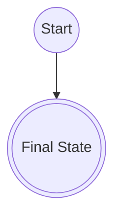
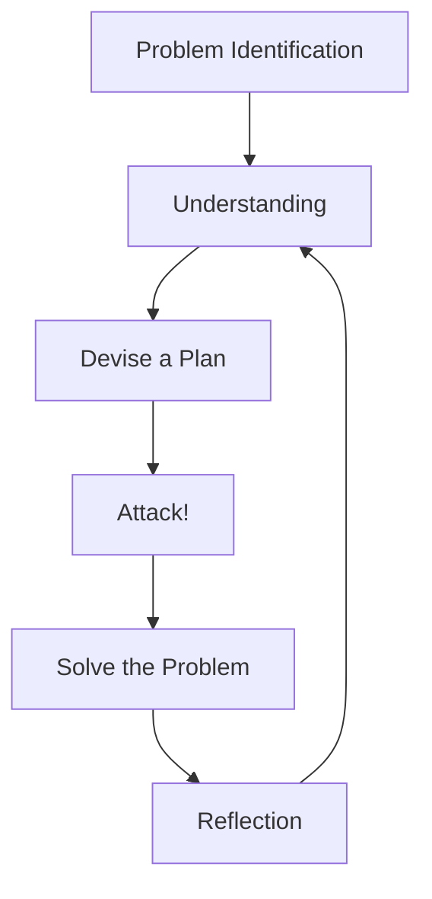

# TODO
- Finish going through videos
- Go back through videos to cover examples
  - Show symbolically
  - Show with code
- Make sure any code snippets are correct.

# Introduction
I found this [playlist](https://www.youtube.com/playlist?list=PLbn9FICCNIGiORzXI6ZsnS7dZdSKlOk1l) on the [Business Process Managmenet & Analytics Group](https://www.youtube.com/@businessprocessmanagementa880)'s (BPMAG) YouTube channel. My initial interest in this set of lectures came from wanting to learn about the [Petri nets](https://en.wikipedia.org/wiki/Petri_net) implemented in [PM4Py](https://pm4py.fit.fraunhofer.de/) and noticed that these lectures discuss Petri nets. Below I go through each video and write down a combination of my impressions and some transcribed points.

# Process Modeling 01: Introduction to Labelled Transition Systems

<iframe width="560" height="315" src="https://www.youtube.com/embed/m2S495baBe0" title="YouTube video player" frameborder="0" allow="accelerometer; autoplay; clipboard-write; encrypted-media; gyroscope; picture-in-picture; web-share" allowfullscreen></iframe>

A system will have a collection of states and a collection of actions.

> **Definition**
>
> A **state** of a system is a possible configuration of the system.

> **Definition**
>
> An **action** is the transition of the system from one state to another state.

> **Definition**
>
> The **behaviour** of a system is the set of all *allowed* sequences of actions that system can take.

> **Definition**
>
> A [**transition relation**](https://en.wikipedia.org/wiki/Transition_system#Formal_definition) is a subset of $S \times S$ where $\times$ denotes the Cartesian product and $S$ is a set of states of a system. We say that there is a transition from state $p$ to state $q$ iff $(p,q) \in T$, and denote it $p \rightarrow q$.

> **Definition**
>
> A [**transition system**](https://en.wikipedia.org/wiki/Transition_system#Formal_definition) is a pair $(S,T)$ where $S$ is a set of states and $T$ is a transition relation.

> **Definition**
>
> A [**labelled transition relation**](https://en.wikipedia.org/wiki/Transition_system#Formal_definition) is a subset of $S \times \Lambda \times S$ where $S$ is a set of states and $\Lambda$ is a set of labels. We say that there is a transition fr om state $p$ to state $q$ with label $\alpha$ iff $(p, \alpha, q) \in T$, which we denote $p \overset{\alpha}{\longrightarrow} q$.

> **Definition** 
>
> A [**labelled transition system**](https://en.wikipedia.org/wiki/Transition_system#Formal_definition) is a tuple $(S, \Lambda, T)$ where $S$ is a set of states, $\Lambda$ is a set of labels, and $T$ is a labelled transition relation.

> **Definition** (Alternative)
>
> A [**labelled transition system**](https://youtu.be/m2S495baBe0?t=448) $L$ is a tuple $(Q, A, \rightarrow, s_i, \Omega)$ where $Q$ is a set of states, $A$ is a set of actions, $\rightarrow$ is a set of transitions, $s_i \in Q$ is an initial state, and $\Omega \subseteq Q$ is a set of final states.

The latter definition of the "labelled transition system" is a little more expressive in specifying which states are initial and final, which the former definition does not. But the former definition is careful to construct ternary relations for the transitions in a way that the latter definition is not.

> **Definition**
>
> A **silent action** is a transition without a label, and is performed by the system itself.

> **Question**
>
> Are silent actions in a labelled transition system represented by an 'empty symbol' of some kind?

> **Question**
>
> In what sense can a silent action 'just happen' that labelled actions cannot?

> **Definition**
>
> A **final state** of a system is a state of the system in which the process ends.

> **Definition**
>
> A **single step** $L: p \overset{\alpha}{\longrightarrow} q$ is a synonym for a transition $(p, \alpha, q) \in T$. The states $p$ and $q$ belong to a set of states $Q$, and $T$ is a transition relation on $Q$.

> **Definition**
>
> A **silent step** is a silent action $L: S \implies s^{\prime}$ where $\implies$ represents a transition performed by the system. 

> **Convention**
>
> Silent steps are sometimes ignored writing state transitions in which silent steps between those states are required.

> **Convention**
>
> When drawing graph diagrams of a labelled transition system, the final state nodes are often drawn with double-circled nodes and the rest of the nodes are drawn with a single circle.
>

Here is an example of this convention.


# Process Modelling 02: Modelling with Labelled Transition Systems

<iframe width="560" height="315" src="https://www.youtube.com/embed/RDGA2qxC5EU?start=448" title="YouTube video player" frameborder="0" allow="accelerometer; autoplay; clipboard-write; encrypted-media; gyroscope; picture-in-picture; web-share" allowfullscreen></iframe>


## Reflective Modelling Cycle
Here is the reflective modelling cycle, which provides a guideline for working on a process modelling problem.



- Helps in analyzing a modelling situation.
- It is about thinking systematically about a problem in order to find a solution.
- Two common questions to ask about labelled transition systems:
  - What resembles each state?
  - What resembles each action?

### 0 Problem Identification
- What is the problem?
- Which questions should I answer in order to solve the problem?
- Which conditions are there?
- Can I divide the problem into smaller parts?
  - What is the relation between the parts?
  - How are the parts mutually dependent?
  
### 1 Understanding
- How does each part fit into the bigger picture?
- What information do I need to model each part?
- What are the properties the model needs to satisfy to be correct?
- What are the main concepts?
- Can I define all concepts in my own words?
- What is the relation between the concepts?
  - What are their dependencies?
  - Does the relation imply an order?
    - If so, do I need to consider [order theory](https://en.wikipedia.org/wiki/Order_theory) formally or think about order informally?
  - What is the purpose of the relation?
  - Can I rephrase the questions with these concepts?
  - How can I represent this in my model?
- Do I have sufficient information to answer the questions?
  - Can I omit information?
  - Can I merge information?
  
### 2 Devise a Plan
- Which modelling language am I going to use?, and why?
- How does it help solve the problem?
- What are advantages in solving this case?
- What are disadvantages in solving this case?
- How does each part of the problem fit into the current model?
- What are possible pitfalls?
- What are the options to model this part?
  - What are the advantages of this option?
  - What are the disadvantages of this option?
  - Which option do I choose, and why?
- Does the chosen option cover the part sufficiently?

### 3 Attack!
- Create the chosen option.
- How do I merge this part into the model?
  - When is the merger correct?
- Did I satisfy all conditions?
- Is all given information in my model?
  - Are all the main concepts present?
  - Are all the relations represented?
- Did I model this part sufficiently?
- Can I simplify the model without losing information?
  - Should I add elements?
  - Can I leave out elements?
- Am I satisfied with the model? Why?

### 4 Solve the Problem
- Can I answer the questions with this model?
- Can I phrase the answer using main concepts?
- What is the solution to the problem?
- Does my solution solve the problem? Why?

### 5 Reflection
- Could I model the problem differently?
- Did I divide the model in a correct manner?
- Which abstractions did I use? Why?
- What are good apsects of my model?
- What could be improved in my model?
- What can I reuse for next time?

#  Process Modeling 03: Breadth First Search 

<iframe width="560" height="315" src="https://www.youtube.com/embed/ofTj38yXTa4?start=448" title="YouTube video player" frameborder="0" allow="accelerometer; autoplay; clipboard-write; encrypted-media; gyroscope; picture-in-picture; web-share" allowfullscreen></iframe>

See [breadth-first search](https://en.wikipedia.org/wiki/Breadth-first_search) for more information.

- Visit neighours systematically
  1. Keep track of the neighbours of the nodes you have visited.
  2. Keep track of the nodes you have visited.
  
The video goes over an example of breath-first search, but it doesn't really explain why we should care about it. Here is my guess of its purpose in the context of labelled transitions systems. Starting a node $s$ and given a target node $t$, find a valid path to that target node. When there are multiple nodes this could be adjusted to considering a the problem of finding a path from the starting node to *any* terminal node.

#  Process Modeling 04: Depth First Search 

<iframe width="560" height="315" src="https://www.youtube.com/embed/fBSG-egK8jg?start=448" title="YouTube video player" frameborder="0" allow="accelerometer; autoplay; clipboard-write; encrypted-media; gyroscope; picture-in-picture; web-share" allowfullscreen></iframe>

See [depth-first search](https://en.wikipedia.org/wiki/Depth-first_search) for more details.

- Two principles:
  - Dive as deep as possible
  - If you cannot go deeper, then step back and dive again!
- Keep track of:
  - Nodes to visit
  - Nodes seen
  - Nodes finished

I have a similar view of this exposition of depth-first search as I did of breadth-first search.
  
#  Process Modeling 05: Dijkstra's Algorithm 

<iframe width="560" height="315" src="https://www.youtube.com/embed/3RNz3rLPxqc?start=448" title="YouTube video player" frameborder="0" allow="accelerometer; autoplay; clipboard-write; encrypted-media; gyroscope; picture-in-picture; web-share" allowfullscreen></iframe>

 See [Dijkstra's algorithm](https://en.wikipedia.org/wiki/Dijkstra%27s_algorithm) for more details.
 
 I have a similar view of this exposition of Dijkstra's search algorithm as I did of breadth-first search and depth-first search. These are classic, and useful, algorithms. But the point of discussing them has not been made apparent by the lecturer.
 
# Process Modelling 06: ?

Doesn't seem to be in the playlist, nor is it among the publically-available videos on the BPMAG's YT channel.
 
#  Process Modeling 07: Identifying Processes Using Process Maps  

<iframe width="560" height="315" src="https://www.youtube.com/embed/tD7lsMuUaDc?start=448" title="YouTube video player" frameborder="0" allow="accelerometer; autoplay; clipboard-write; encrypted-media; gyroscope; picture-in-picture; web-share" allowfullscreen></iframe>

- A process:
  - Has a common goal to be reached.
    - Each activity should contribute to a/the goal.
  - Describes all allowed sequences of activies to reach a goal.
    > **Definition**
    >
    > A sequence from start-to-finish is called a **process instance**.
    
    > **Proposition**
    >
    > There exists a process with an infinite number of process instances.
  - Has a single object all activities contribute to.
    - What describes an instance of the process?
    - Rule of thumb: each activity has the same direct object.
    
It seems that "process" is similar to "behaviour of a system" that we observed in the first lecture.

See [business process mapping](https://en.wikipedia.org/wiki/Business_process_mapping) for more details.

#  Process Modeling 08: The Synchronous Product 

<iframe width="560" height="315" src="https://www.youtube.com/embed/BL3u94JgoHE?start=448" title="YouTube video player" frameborder="0" allow="accelerometer; autoplay; clipboard-write; encrypted-media; gyroscope; picture-in-picture; web-share" allowfullscreen></iframe>

- Divide and conquour is the main principle of modelling.
  - Divide your problem into parts.
  - Solve the smaller parts.
  - Combined the parts into a model.
- The divide and conquour (DaC) approach tends to work well when the smaller problems are easier to solve.
- DaC can be used with labelled transition systems (LTS).
- Consider usig DaC in smaller LTCs denoted $L_1 \ldots L_n$ for $n$ number of smaller LTCs.

> **Definition**
>
> Given a set of LTSs 
>
> $$\begin{align} L_1 &= (S_1, A_1, \rightarrow_1, s_1^{\prime}, \Omega_1) \\ \vdots &= \vdots \\ L_n &= (S_n, A_n, \rightarrow_n, s_n^{\prime}, \Omega_n) \end{align}$$
> 
> their **synchronous product** $L_1 \times \cdots \times L_n$ is a LTS $L = (S, A, \rightarrow, s_i, \Omega)$ where
>
> $$\begin{align} S &= S_1 \times \cdots \times S_n \\ A &= \bigcap_{i=1}^n A_i \\ \rightarrow &= \{ ((s_1, \ldots, s_n), a, (s_1^{\prime}, \ldots, s_n^{\prime})) \vert a \in A \cup \{ \tau \} \forall 1 \leq i \leq n : (L_i : s_i \overset{a}{\longrightarrow} s_i^{\prime})\} \\ s_i &= (s_1^{\prime}, \ldots, s_n^{\prime}) \\ \Omega &= \Omega_1 \times \cdots \times \Omega_n \end{align}$$
>
> where $\tau$ is a silent transition symbol.


Here is a toy example implementing such a product using operator overloading of `*` by defining `__mul__`.

```python
# TODO: Test that this code actually works.
class LTS:
    """
    Class representing a Labelled Transition System (LTS).

    Attributes:
        S (list): List of states in the LTS.
        A (list): List of actions in the LTS.
        transitions (dict): Dictionary representing transitions in the LTS.
                            Key: state, Value: dict representing actions and their corresponding next states.
        initial_state: Initial state of the LTS.
        accepting_states (list): List of accepting states in the LTS.

    Methods:
        __mul__(other): Overloaded multiplication operator to perform the synchronous product of two LTSs.
    """

    def __init__(self, S, A, transitions, initial_state, accepting_states):
        """
        Initialize the LTS object.

        Args:
            S (list): List of states in the LTS.
            A (list): List of actions in the LTS.
            transitions (dict): Dictionary representing transitions in the LTS.
                                Key: state, Value: dict representing actions and their corresponding next states.
            initial_state: Initial state of the LTS.
            accepting_states (list): List of accepting states in the LTS.
        """
        self.S = S
        self.A = A
        self.transitions = transitions
        self.initial_state = initial_state
        self.accepting_states = accepting_states

    def __mul__(self, other):
        """
        Overloaded multiplication operator to perform the synchronous product of two LTSs.

        Args:
            other (LTS): The other LTS object to perform the synchronous product with.

        Returns:
            LTS: Resulting LTS after performing the synchronous product.
        """
        if not isinstance(other, LTS):
            raise TypeError("Operand must be an LTS")

        S = []
        for s1 in self.S:
            for s2 in other.S:
                S.append(s1 + s2)
        A = set(self.A).intersection(set(other.A))
        transitions = []
        initial_state = self.initial_state + other.initial_state
        accepting_states = []
        for a1 in self.accepting_states:
            for a2 in other.accepting_states:
                accepting_states.append(a1 + a2)

        for s1 in self.S:
            for s2 in other.S:
                for a in A:
                    if (s1 in self.transitions) and (s2 in other.transitions):
                        s1_prime = self.transitions[s1].get(a)
                        s2_prime = other.transitions[s2].get(a)
                        if s1_prime and s2_prime:
                            transitions.append((s1 + s2, a, s1_prime + s2_prime))

        return LTS(S, A, transitions, initial_state, accepting_states)
```

And here is an example usage:

```python
# TODO: Test that this code actually works.
# Define LTS1
S1 = ['s1', 's2']
A1 = ['a', 'b']
transitions1 = {'s1': {'a': 's2', 'b': 's1'}, 's2': {'a': 's1', 'b': 's2'}}
initial_state1 = 's1'
accepting_states1 = ['s2']

lts1 = LTS(S1, A1, transitions1, initial_state1, accepting_states1)

# Define LTS2
S2 = ['s3', 's4']
A2 = ['a', 'c']
transitions2 = {'s3': {'a': 's4', 'c': 's3'}, 's4': {'a': 's3', 'c': 's4'}}
initial_state2 = 's3'
accepting_states2 = ['s4']

lts2 = LTS(S2, A2, transitions2, initial_state2, accepting_states2)

# Perform synchronous product
product_lts = lts1 * lts2

# Access the properties of the product LTS
print(product_lts.S)
print(product_lts.A)
print(product_lts.transitions)
print(product_lts.initial_state)
print(product_lts.accepting_states)
```

#  Process Modeling 09: Applying the Synchronous Product in Modelling 

<iframe width="560" height="315" src="https://www.youtube.com/embed/jwTnYifOgT8?start=448" title="YouTube video player" frameborder="0" allow="accelerometer; autoplay; clipboard-write; encrypted-media; gyroscope; picture-in-picture; web-share" allowfullscreen></iframe>

- Gives an example of using the synchronous product to construct a LTS from a collection of LTSs.
- What is more interesting to me is to start with an LTS and see if I can cleanly decompose it into simpler LTSs.
