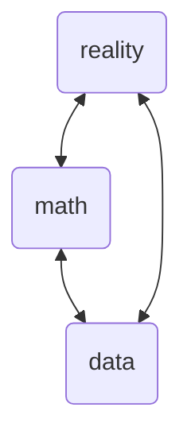

This post is part of a collection of posts responding to the following video.

<iframe width="560" height="315" src="https://www.youtube.com/embed/qee6b7vl2O0" title="YouTube video player" frameborder="0" allow="accelerometer; autoplay; clipboard-write; encrypted-media; gyroscope; picture-in-picture; web-share" allowfullscreen></iframe>

> **Quotation** (Dustin Fife)
> 
> My belief is that nature behaves lawfully. [...] Nature follows laws.

I think in some vague metaphorical sense I agree. When I choose to navel-gaze about this sort of thing I think of an acronym I developed: LSTOD.

LSTOD stands for *locally strictly totally ordered determinism*. It is a property certain types of mathematically formal systems can have. The basic notion is that there exists a collection $\Omega$ of all states of the system with some additional contraints that pertain to the long-winded sequence of adjectives that strangely are best explained in reverse order to how they are given in the acronym. 

The word *determinism* doesn't add anything concrete but is just a vague gesture that this is something relevant to determinism of some sort. 

The next word *order* is important. The system should follow some kind of ordering in how it evolves. There are different sorts of mathematical orderings described in Order Theory. This word provides some flavor and indication that I am referring to some sort of binary relation on the set of states of the system. A binary relation $R$ is a subset of a [Cartesian product](https://en.wikipedia.org/wiki/Cartesian_product), denoted $R \subseteq S \times S$ where $S$ is some collection for which the Cartesian product is defined. Perhaps the most common form of order I deal with are [posets](https://en.wikipedia.org/wiki/Partially_ordered_set).

The next word after, *totally*, finally hits on something definite. I believe that the notion of a [total order](https://en.wikipedia.org/wiki/Total_order) is relevant in understanding the world. Although I don't think it has to be a total order *per se*. I'll elaborate when I hit on that topic with the last word.

The pentultimate word is *strictly*. It is a necessary condition for a system to exhibit LSTOD that the states are never in the same position in this order relation, and it further makes no sense to say that a state is before itself.

But now we get to the word *local* that adds an important caveat to the above properties. Only within a local [neighbourhood](https://en.wikipedia.org/wiki/Neighbourhood_(mathematics)) of points must we take a system to be a strict total order on the set of states in order for that system to have LSTOD. The global structure may not be total, such as if the states form a loop with possibly finite or infinite [measure](https://en.wikipedia.org/wiki/Measure_(mathematics)) (if we assume it is a [measure space](https://en.wikipedia.org/wiki/Measure_space)).

Note that LSTOD does not assume that the system is [dense](https://en.wikipedia.org/wiki/Dense_set) or continuous in any sense (e.g. [Lipschitz](https://en.wikipedia.org/wiki/Lipschitz_continuity), [absolute](https://en.wikipedia.org/wiki/Absolute_continuity), [uniform](https://en.wikipedia.org/wiki/Uniform_continuity), or others). The system could be a sequence in which we could conceive of there being a next or successor element, or not. LSTOD assumes relatively little compared the variety of properties we might impose.

Personally, I find the idea that the whole world can be hypothetically considered to exhibit LSTOD rather convincing. LSTOD as a description for the entire world is not a claim I know how to empirically investigate, so don't hold your breath on a scientific paper on it. Indeed, a blog is perhaps one of the more appropriate places to share such an idea. It is rather a philosphical position which meets, in my view at least, the criterion of being consistent with all of my experience.

Now I should add that LSTOD would seem to contradict branches of modern physics such as Quantum Mechanics and General Relativity in many people's view. It requires a lengthy explanation of the mathematics, experimental data, and correspondence principles to understand why I think they are not in contradiction with LSTOD. The short version is I don't find issue with the experiments or mathematics, but rather on the choices of correspondence principles used. The correspondence principles are the ways in which we understand the relationships between our thinking (including mathematics), data and experiment, and the rest of reality. This is loosely characterized in the following diagram where the double-headed arrows represent some correspondences between the nodes:

So the previous paragraph is just to give some caution to the reader that my views on this are controversial and hypothetical rather than conventional and actual. But since we're sharing half-baked ideas about the world being 'lawful', LSTOD is my conception of that lawfulness. Mind you, my view of it isn't a regression model *per se*.

> **Quotation** (Dustin Fife)
> 
> My belief is those laws can be expressed mathematically.

I think this is true to a large extent, but there are limitations I think are worth mentioning. 

One of them is that the details of the math, even if a good model in principle, may be too complicated to use. I've never seen anyone succeed at modelling even a cubic centimeter of ordinary air with the [standard model](https://en.wikipedia.org/wiki/Standard_Model) of particle physics. And I don't expect anyone will. Whenever one starts considering how to set up [Lagrangians](https://en.wikipedia.org/wiki/Lagrangian_(field_theory)) or [Hamiltonians](https://en.wikipedia.org/wiki/Hamiltonian_(quantum_mechanics)) for complex systems it becomes quickly obvious that we cannot even write down the complete mathematical description of all the contributions from different parts of the state. The world is a big and complicated place.

Another issue is a kind of [observational equivalence](https://en.wikipedia.org/wiki/Observational_equivalence). Statisticians are familiar with the problem of whether a [statistical model](https://en.wikipedia.org/wiki/Statistical_model) (in a convetional sense, not mine or Dustin's) is [identifiable](https://en.wikipedia.org/wiki/Identifiability). But it is a more pervasive problem than that. While we could turn to various philosophical treatise both ancient and recent, I think a more definite problem comes from function approximation. Many of the models that we use are functions which are fit to data (often but not always by searching a space of parameters). But it turns out that functions can look arbitrarily close to one another under very mild mathematical assumptions (e.g. Lipschitz continuity and [compactness](https://en.wikipedia.org/wiki/Compact_space)). Yes, *arbitrarily close*. This indicates that on pure fit alone (or test scores on test data for that matter), we cannot determine a uniquely best mathematical model even when we are considering fit according to a single object function.

I think that purely predictive models are interesting and useful. I've trained my fair share of neural networks, random forests and other machine learning models to say I genuinely enjoy it. But that's not, in my opinion, all that we should be asking of our models in the long run view. Among these additional criteria (that I have in mind anyway) are causally valid models (see [Pearl 2010](https://www.ncbi.nlm.nih.gov/pmc/articles/PMC2836213/) for a brief introduction, however his most comprehensive work is [Pearl 2009](http://bayes.cs.ucla.edu/BOOK-2K/)) I think the notion that prediction alone is not enough is potentially one of the points that Dustin and I can recover some points of agreement from, although I don't know what he thinks about formal causal inference or other criterion that we might suggest.

> Both predictions and counterfactual predictions can in principle be made arbitrarily well by an infinite family of functions. The [Stone-Weierstrass](https://en.wikipedia.org/wiki/Stone\%E2\%80\%93Weierstrass_theorem) and [universal function approximation](https://en.wikipedia.org/wiki/Universal_approximation_theorem) theorems demonstrate this problem. [Carleson's theorem](https://en.wikipedia.org/wiki/Carleson\%27s_theorem) somewhat qualifies in its own right, although I am not sure how noise complicates it. There are also results such as [Domingos 2020](https://arxiv.org/abs/2012.00152) that I have not checked. There are also exact equalities such as [Bernstein's theorem on monotone functions](https://en.wikipedia.org/wiki/Bernstein\%27s_theorem_on_monotone_functions). It would require infinite precision to distinguish universal function approximators from whatever the "true" pattern is. It isn't just "universval" cases that are a concern. There are plenty of simulation examples of where a family of functions is sufficiently expressive that it can be made to fit data sets that are not the true data generating process. Theorems are just a formalized nail in the coffin.
{: .prompt-info }

But bringing in more objectives or criteria on which to evaluate models is not a free lunch either. Having multiple objectives for our models opens up the possibility of [Pareto fronts](https://en.wikipedia.org/wiki/Pareto_front) of models over those objectives. I personally found [Emmerich & Deutz 2018](https://link.springer.com/article/10.1007/s11047-018-9685-y) to be a better introduction to the mathematical prerequisites of Pareto fronts than the Wikipedia page if you want to look further. But the basic notion is straightforward: there can be unresolvable tradeoffs.

> Note that the notion of a Pareto front does not require anything more about the objectives than that they have a certain order relation. This works for ordered categories and ordered binary variables. It is therefore not any kind of refuge to claim that there are 'qualitative' criterion that are not subject to this problem. If you prefer one thing to another, that implies an order relation. The funny thing about us humans is we often have intransitive preferences, suggesting we're not really consistent in what we prefer. But perhaps that can eventually be explained by a more complicated set of preferences.
{: .prompt-info }

> **Quotation** (Dustin Fife)
> 
> So I see Science as the process of uncovering the mathematical structure of Nature.

Personally, I don't. I see the role of mathematics in modelling the world as something more akin to cartography. I believe I mentioned the [map-territory relation](https://en.wikipedia.org/wiki/Map%E2%80%93territory_relation) already in the [*Actually Modelling The Data*](https://galenseilis.github.io/posts/actually-modelling-the-data/) post, and there I have linked to some excellent blog posts.

Mathematics is among our best approaches for modelling, but I tend to believe that both the conventional ontology and correpondence principles for mathematics in relation to the world is somewhat murky and confused. Mathematics in one sense or another is part of what is real. After all, it really is part of our thinking, and our thinking exists in some sense, right? While there are forms of metamathatical mathematics, such as [homotopy type theory](https://homotopytypetheory.org/book/) and [category theory](https://en.wikipedia.org/wiki/Category_theory), I think it eventually leads to self-referential nonsense when you try to ultimately explain math within the world with math.

It is hardly a replacement for reading some of the interesting works that are alluded to in the video, I think watching Veritasium's video will give most people at least an intuitive understanding of the weirdness of metamathematics.

<iframe width="560" height="315" src="https://www.youtube.com/embed/HeQX2HjkcNo" title="YouTube video player" frameborder="0" allow="accelerometer; autoplay; clipboard-write; encrypted-media; gyroscope; picture-in-picture; web-share" allowfullscreen></iframe>

I don't believe that Nature is fundamentally mathematical. In other terms I think that mathematics is worldly, rather than that the world is mathematical. I know that's a vague handy-wavy and pithy claim. But even if we brought in a much more technical discussion about formal theories of proof and decidability in math and computer science, I think the complete way that things are is not accessible to us. Not just in a missing information sense, like not knowing what is inside a cardboard box until you open it. But in a much more fundamental sense that has not, and I suspect cannot, be articulated.

> I do not feel that LSTOD is an exemption to these problems.
{: .prompt-info }

> **Quotation** (Dustin Fife)
> 
> And when we fit a model we are positing what that mathematical structure might look like.
 
I agree in a sense. But for me it is in a sense of metaphorical [cartography](https://en.wikipedia.org/wiki/Cartography). A map maker may posit where roads and lakes are relative to one another on their map, but it is also the case that not everything about the map will be true of the territory. I don't just mean that the map could be made more detailed. I mean that for any map it will always have something about it that is distinct about it from the territory. If truly everything true of the territory were true of the map then it wouldn't really be a map but rather the territory itself. That is to say, our models will always be different from the world.
 
> **Quotation** (Dustin Fife)
> 
> When we use nonparametric statistics it runs counter to that notion. Nonparametric statistics don't actually model the mathematical structure of Nature.

My impressions of this quote I think are largely discussed in [*Actually Modelling the Data*](https://galenseilis.github.io/posts/actually-modelling-the-data/), but I will say little bit more here at the risk of repeating myself. 

Nonparametric statistics are obviously mathematical, so I don't think "mathematical structure" is a clear criterion to use. I'm still not confident about what Dustin considers to be an 'actual model', but I think in most contexts we can consider any piece of math that is used to represent something else to be a mathematical model. That's not precise, but sticking more closely to what I would use as a criterion for a "mathematical model".

> Instead they modify the nature of your data so that it kind-sorta looks like a mathematical model.

Every function you apply to the data that isn't the identity function will in some way change your data. This includes linear models. Why would scaling the variables and then adding them together be a good idea? Well, because they may approximately equal something that we care about it. 

The primary reason to rank data is to facilite the study the order properties of the data. One metaphor is that we are 'extracting' certain properties as if performing a chemical extraction in a lab. Why would we extract chemicals from other chemicals? To study certain chemicals in isolation from the others! The intuition with ranks is similar. Ranking the data allows us to study order properties in a way that has been 'purified' from many of the other properties of the data.

> So its just a hack. A temporary fix to get you an answer.

I'm in favour of people finding better ways of doing something. So if a given phenomena can be better modelled with a parametric model rather than a given nonparametric model I think that's great. But I don't think that nonparametric statistics, rank-based or not, are inherently hacks or temporary fixes. Certainly people *can* and *have* used them as such, but that doesn't not preclude using them in a non-hacky way. Even if we intend for something to be a permanent solution to a problem, often it is not and that's okay.

Dustin's philosophical view that the world is lawful I think is largely compatible with my own view, and we agree that mathematics should be involved in scientific research. I tend to be somewhat optimistic that mathematics is useful and pessimistic that it is fundamental. I don't know if Dustin would agree with that. Lastly, I don't think nonparametric statistics is just, as Gandalf put it, "*a conjurer of cheap tricks*".
