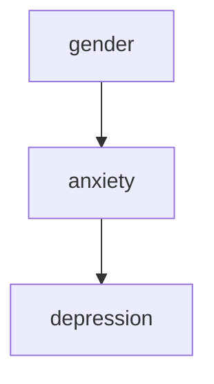
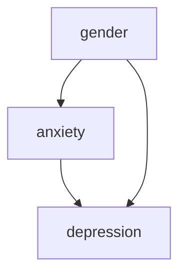

This post is a response to the following video:

<iframe width="560" height="315" src="https://www.youtube.com/embed/AhY0TyFZiqg" title="YouTube video player" frameborder="0" allow="accelerometer; autoplay; clipboard-write; encrypted-media; gyroscope; picture-in-picture; web-share" allowfullscreen></iframe>

> Quotation (Dustin Fife)
>
> I realized that I think very differently than, certainly my non-statistician collegues, and maybe even my statistician collegues. I don't know. I'm going to put this out there and see if anybody thinks the same way that I do.

I think putting our thinking out there can be scary sometimes because we're afraid of being shown to be wrong. But that protects our beliefs as they are, right or wrong (and they're probably wrong), instead of creating opportunities to get feedback. I really respect Dustin for publicly sharing his thinking and for showing awareness that there may be new things to learn. This isn't to say that all feedback is useful, but I'll try to provide some in this post.

> Quotation (Dustin Fife)
A student had brought me an analysis that they had done where it was basically just a multiple regression with like 10, actually I think it was 12, different predictor variables. And they said, *"Here, what do you think? How'd I do?"*.

I have had a rather similar experience of someone coming to me with a multiple linear regression and seeking feedback, although it wasn't quite as terse as *"Here, what do you think? How'd I do?"*. But the analysis I had been shown did have some room for improvement, and would have been better address with a multilevel ordinal logistic regression.

> Quotation (Dustin Fife)
>
> And my first thought when I see that many predictors variables in a multiple regression is t- my gut reaction is to say you have too many variables. You're doing something wrong here.

Somethings a model might have too many variables according to some decision rule. But I don't know what this means without additional context.

> Quotation (Dustin Fife)
>
> When I use multiple regression, or the basic general linear model, what I tend to do is I try to think in terms of hypotheses. I have a hypothesis, and in my mind hypotheses are tied to specific parameters.

I think that tying hypotheses to parameters can be productive, but I want to caution that it can be narrow. For example, I may be interested in the dynamical equations that govern a system. My hypothesis about a system may not be about the parameters *per se*, which may be quite system dependent in some cases, but about the form of the differential equations that describe how a system's parts are related to each other (and other how they change with respect to time).

While I sometimes think they go a little too far in their disdain for parameters, some physicists like to have as few parameters as they can get away with. In the extreme of these views is that parameters are bad and we should try to keep them out of our models when we can. I personally don't take that extreme view mainly because introducing parameters is quite useful. 

Von Neumann purportedly had an [elephant example](https://en.wikipedia.org/wiki/Von_Neumann%27s_elephant) about which he is reported to have said:

> Quotation (Von Neumann)
>
> With four parameters I can fit an elephant, and with five I can make him wiggle his trunk.

This quote about a parametric elephant was a quip about how having too many parameters in certain physical simulations was a bad thing.

The point of my example here is there are other ways to think of hypotheses, not that we should take an extreme position against using parameters.

> Quotation (Dustin Fife)
>
> Like, I think the effect anxiety on depression depends on one's gender. And so that sort of hypothesis says you're going to have a different slope for men and a different slope for women.

To me the notion of "the effect of anxiety on depression depends on one's geneder" connotes a couple of different [causal diagrams](https://en.wikipedia.org/wiki/Causal_model) (supposing that there are not other variables to consider).

The first one is that there is that gender has an indirect effect on depression via anxiety.

And the second is that gender additionally has a direct effect on depression.

I don't know much about the science of these variables so I won't opine on whether either of these causal models make sense. But I will say that causal models should be more important to scientists than statistical models. Statistical models are essential, but they will accomodate both valid and invalid causal structures. I think that scientists should consider the causality of their problem before the statistics.

Get your hands on a copy of [Pearl 2009](http://bayes.cs.ucla.edu/BOOK-2K/) for a deep-dive into causality.

> Quotation (Dustin Fife)
>
> And so in my mind I'm translating that into a linear model and then I'm - Once I've translated it into a linear model then I'm trying to think about what specific parameter is my hypothesis about. 

I don't see why linear models should be assumed *a priori*. Linear models consistute a minority of the models that I train. Not an insignificant minority, but not enough that I would go straight to them by default.

> Quotation (Dustin Fife)
>
> And in that case its the interaction effect. Cause you're hypothesizing that there are different slopes for men vs women. So its tied to one parameter.

Interaction effects are one way to mathematically represent the notion that "effect anxiety on depression depends on one's gender". An interaction effect for a collection of random variables equipped with scalar multiplication takes the form of 

$$\phi (X_1, \ldots, X_n) \triangleq \beta \prod_{i=1}^n X_j$$

where $\beta$ is usually an element of a field such as the real numbers. While I'm too tired/lazy to write it out, you can show that $\frac{\partial}{\partial x_i} \mathbb{E}[\phi (X_1, \ldots, X_n)]$ does depend on the particular combination inputs $x_1, \ldots, x_n$ under quite mild assumptions. We can also notice that $\phi$ is a [multilinear map](https://en.wikipedia.org/wiki/Multilinear_map) and can constucted as an element of the image of a [tensor product](https://en.wikipedia.org/wiki/Tensor_product) of random vectors. This entails an interesting, to me, relationship between interaction effects and certain exploratory methods like [PCA](https://en.wikipedia.org/wiki/Principal_component_analysis) and its generalization [canonical polyadic decomposition](https://en.wikipedia.org/wiki/Tensor_rank_decomposition).

But more broadly than interaction effects is that any model in which the partial derivative of the (usually conditional) expectation is a multivariable function who value depends on the combination of the input will constitute some sort of interaction. Sometimes derivatives do not exist, so I expect there are further mathematical concepts that would show more possibilities (e.g. properties of finite differences).

> Quotation (Dustin Fife)
>
> But when you have twelve variables I want to ask what is the hypothesis and very often students or fellow faculty members  have a hard time identifying their hypothesis.

People, including me, definitely struggle to clarify their thinking. Engineers and software developers are especially aware of this challenge when it comes to turning other people's (often vaguely-phrased) requirements into technical requirements for a product. And I think scientists likewise spend a lot of time trying to just clarify and articulate what that vague notion is that they're chasing after.

When it comes to having 12 variables, I don't think that is necessarily a problem.

> Quotation (Dustin Fife)
>
> Or it tends to be like which of these is the best predictor. Actually, they don't even say it in those terms. Cause if they said it in those terms I'd get it. Instead what they say is,"how do these variables relate to the outcome?" And see that's not specific enough for me. And I don't think it is a very refined hypothesis.

I find that there is *some* ambiguity about "best predictor". There are a variety of different things that might mean depending on what is meant by *best*.

I absolutely agree that "how do these variables relate to the outcome?" is quite unrefined. I'm not sure I would even call it a hypothesis as it doesn't posit anything. It is just a vague and open-ended question. I don't mind vague and open-ended questions. Quite the opposite, I thin they are great starting places for exploring a topic. But by the time we are considering using statistics in a model I think Dustin and I agree that it will require more precise notions.

> Quotation (Dustin Fife)
>
> You basically have two ways of doing statistics. One that is hypothesis driven in which case it is very rare to have specific hypothesis that includes more than [...] 2 or 3 variables. I rarely see a hypothesis, a specific hypothesis, that has more than 3 variables. 

Those are definitely two objectives that people might have. Perhaps they can be mixed to an extent. 

I see hypotheses, as I understand them, involving models with more than 3 parameters quite often. I'm honestly astonished that Dustin thinks that only three variables (predictors) would be some upper limit on a hypothesis-driven model. And I'm not splitting hairs about how a given variable can, in variety of ways, be decomposed into a collection of multiple variables. I mean in many disciplines from physics, chemistry, biology, psychology, sociology, economics, medicine, finance, operations research, and more that it is relatively easy to find models that involve more than 3 variables.

One thing I think about as a former biochemistry and molecular biology major is the sheer number of types of molecules in the human body. Pick a pathway or cellular compartment described in [Lehninger](https://www.amazon.ca/Lehninger-Principles-Biochemistry-David-Nelson/dp/1429234148) and you're bound to find that the number of variables is gobsmacking.

I'm not convinced that 3 variables is a good limit. Partly because I don't understand the relevance of such a threshold, it seems arbitrary to me, but also because the sciences are chalk full of models with more than 3 variables.

> Quotation (Dustin Fife)
>
> So you're either in that category or you're in the category of what I would call "data mining" where you're saying "I've got all these predictor variables and I wanna know which one, or ones, are the best predictors".

I remember taking a data mining course in my graduate studies in which we covered some of the classic [frequent pattern mining](https://en.wikipedia.org/wiki/Frequent_pattern_discovery) algorithms including *a priori*, [VIPER](https://www.researchgate.net/publication/279505089_VIPER_A_Vertical_Approach_to_Mining_Association_Rules), ECLAT (I think [Li *et al* 2007](https://dl.acm.org/doi/10.1145/1281192.1281240) if memory serves), and [FP-Growth](https://www.cs.sfu.ca/~jpei/publications/sigmod00.pdf). These algorithms are data mining algorithms in the sense that they extract patterns from data. But they're not predictive *per se*.

It is also true that you can use predictive models to either mine patterns, but I prefer to think of predictive modelling as distinct from data mining. It is admitably a murky distinction and there are heated debates about where machine learning begins and data mining ends. I would contend that common clustering algorithms are usually in the data mining and in the machine learning bucket. I'm less convinced that common predictive models in machine learning (e.g. transformers in deep learning) are data mining algorithms. They learn patterns in some sense, but the patterns are not necessarily extracted in a way that is accessible to human understanding. And I think that distinction matters for what the motivations of classic data mining were about. The flip side of that is there is an area of research involved in carefully trying to extract patterns from the ML models.

> Quotation (Dustin Fife)
>
> When I see a regression table with lots of predictors my gut reaction is to say, "stop using multiple regression". Multiple regression is terrible for data mining. And instead use something like a random forest or some other AI algorithm. That's what I would do.

It really depends on what the goals are, and more context is required. I cannot tell just from the number of predictors being greater than 3 whether a multiple linear regression is appropriate. And this not just a partitioning between hypothesis-driven and prediction-driven modelling. A multiple linear regresion with more than 3 predictors may or may not be appropriate, and a random forest on 3 more or variables may be inappropriate.

The title of the video (at the time of writing in case it changes) is "*Is this a controversial opinion about statistics*". I'd say that my disagreements suggest "yes", although I don't know that it counts as a controversy if just two people disagree.
