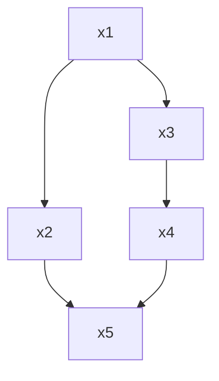

My goal in this post is just to show a little trick to computing a collection of functions in a way that satisfies some partial order.

It is often the case that a collection of functions of methods need to be executed in a computer program. Some functions must be executed before or after each other while other pairs of functions it doesn't matter what order you execute them. This constitutes a [partial order](https://en.wikipedia.org/wiki/Partially_ordered_set) on the collection of functions.  A common case is when there is a [mutual exclusion](https://en.wikipedia.org/wiki/Mutual_exclusion)on a shared resource, or ensuring a transformation of some database satisfies the [ACID](https://en.wikipedia.org/wiki/ACID) principles.

Here is an example. Suppose we have the following collection of functions:

```python
from time import time

def x1():
    print(f'x1: {time()}')

def x2():
    print(f'x2: {time()}')

def x3():
    print(f'x3: {time()}')

def x4():
    print(f'x4: {time()}')

def x5():
    print(f'x5: {time()}')
```

(Okay, these are pretty boring functions but it doesn't really matter what they do for this post.) 

And let's say that there are constraints where some of the functions need to be executed according to an order relation represented by the follow [directed acyclic graph](https://en.wikipedia.org/wiki/Directed_acyclic_graph).  That is $x1 \rightarrow x2$ means that $x2$ must be computed **after** $x1$.




It may seem like a sudden jump to start with partial orders and jump to DAGs, but in fact DAGs are conveniently related to partial orders. Via a [transitive closure](https://en.wikipedia.org/wiki/Transitive_closure) on the edge set of a DAG we can say that every DAG is mapped to a partial order, while a given partial order can be mapped to from different DAGs. So it suffices to specify a DAG with the arrows needed to specify the "skeleton" of the order that we are interested in.

In many cases we might hard code the function calls to satisfy the ordering, like this:

```python
x1()
x3()
x2()
x4()
x5()
```

But sometimes, especially in asynchronous programming, we might not be making the best use of resources to have a fixed order of execution. If `x2` is ready to be computed but not `x3` you wouldn't have to wait around for `x3` to be ready if there is dead time that could be used running `x2`.  I won't be showing examples of asynchronous programming in this post, but I just want to plant the idea.

Let's try a first approximation of this DAG approach by using the `networkx` library. First let's construct a DAG following the order we specified above:

```python
import networkx as nx

g = nx.DiGraph()

g.add_edge(x1, x2)
g.add_edge(x1, x3)
g.add_edge(x2, x5)
g.add_edge(x3, x4)
g.add_edge(x4, x5)
```

Let's assume that each of our functions are ready to be calculated as soon as the ones that come before it in the DAG have been executed. For the function `x1` there are no ancestors, so we'll start there. Once we execute `x1` we could execute either `x2` or `x3` in any order. Once we have execute `x3` we can execute `x4`. Finally, when `x2` and `x4` are executed we can execute `x5`.  One way to keep this organized is to collect the functions into a sequence of batches of functions that will satisfy the partial ordering if we ensure that all functions in a given batch are executed before moving onto the next batch.

When these batches are aligned with the partial ordering in a certain sense we can call them "topological generations". We can obtain the topological generations from an instance of `nx.DiGraph` using `nx.topological_generations`:

```python
>>> list(nx.topological_generations(g))
[[<function x1 at 0x7f80acb27c70>], [<function x2 at 0x7f80acbe2f80>, <function x3 at 0x7f80ac09a4d0>], [<function x4 at 0x7f80a6fc8790>], [<function x5 at 0x7f80a6fc8820>]]
```

So our first approximation can simply be to define a function `caller` that calls its input, loop over the topological generations, then loop over the functions in each topological generation, and call them using `caller`.

```python
def caller(f):
    f()

for tgen in nx.topological_generations(g):
    for func in tgen:
        caller(func)
```

But since we have ensured (hopefully) in the structure of our DAG what partial ordering the functions are called in, it will hold that functions within the same topological generation can be called simultaneously. So a second approximation is to run the functions in each topological generation in parallel.

```python
from multiprocessing import Pool

for tgen in nx.topological_generations(g):
    with Pool(processes=4) as pool:
        pool.map(caller, tgen)
```

The coding pattern above may not be the best way to code things for extremely resource-constrained systems, but hopefully it is occasionally useful.
