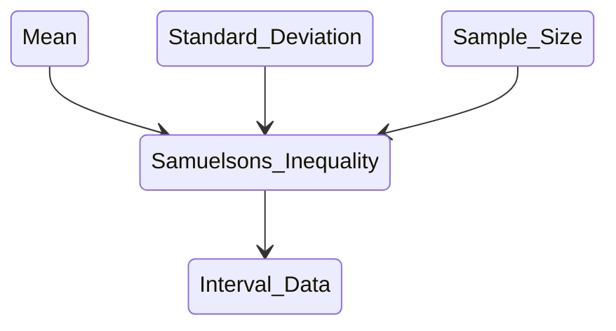

Samuelson's inequality allows us to put bounds on the values in collection of data points that we do not have.

Suppose we are only given the sample mean $\bar x$, sample standard deviation $s$, and the sample size $n$.

We know that the sample mean must have been 

$$\bar x =  \frac{\sum_{i=1}^n x_i}{n}$$

which likewise feeds into the standard deviation

$$s = \sqrt{\frac{1}{n-1} \sum_{i=1}^n \left( x_i - \bar x \right)^2}.$$

Not that this is the sample standard deviation with [Bessel's correction](https://en.wikipedia.org/wiki/Bessel%27s_correction), which is sometimes confused for the distinction of a sample standard deviation vs a population standard deviation. But that is a story for another time.

In turns out that with these facts we can deduce that any $x_i$ from the missing data must satisfy the inequality

$$\bar x - s \frac{n-1}{\sqrt{n}} \leq x_i \leq \bar x + s \frac{n-1}{\sqrt{n}}$$

without needing to know anything about the underlying distribution (statistical population). 

This means that one can start with nothing but these three pieces of summary statistics to produce an interval dataset!

Maybe that doesn't sound exciting yet, but it should! With interval data we can perform [interval arithmetic](https://en.wikipedia.org/wiki/Interval_arithmetic), which is a highly general and flexible approach to do calculations with intervals. The interval data you extract is representing uncertainty about the true values of data that you do not have, and with interval arithmetic we can put bounds on the results of calculations that could have been done with the original data but were not. What's more is you don't need the original data set to do this!

So when you're reading some paper and realize there is an analysis the authors did not perform that you wish they had, you can still take their basic statistical summary and put a range of values on what they would have calculated. It is a bit like magic. Except it is math.

There is one limitation which I have noticed with Likert-like scale data. You're always better off just taking the known bounds of the scale (i.e. 1 and 5, or 1 and 7) to obtain the intervals on missing values. The intervals obtained from Samuelson's inequality will always be wider.

Now this is all relatively free of probability models. That can be a nice thing. But we can bring back probability in an interesting way. When it comes to performing Bayesian inference we like to put prior information on our parameters. When conducting some forms of Bayesian meta-analysis we may have only these sorts of summary information to begin with in some of the studies we have aggregated. But the Samuelson inequality allows us to put bounds on the missing values, which might help make your Bayesian model be more precise from the start.
