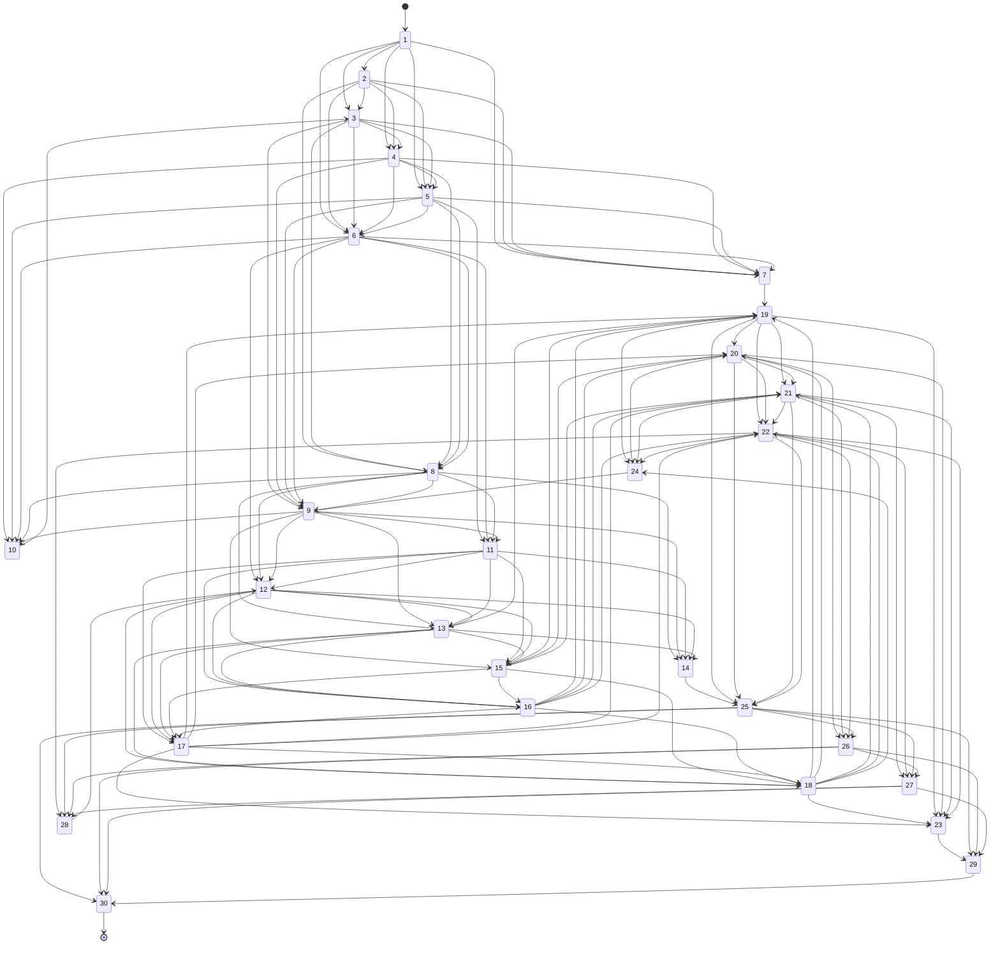

## Background

Ciw can be used to bring discrete event simulation to games. In this post I considered a Ciw-ified version of [Snakes and Ladders](https://en.wikipedia.org/wiki/Snakes_and_ladders). There are aspects that we can faithfully and naturally represent and other aspects that we cannot.

First, let us suppose that there is a sequence of $n$ tiles labelled $1$ to $n$. It has been known for decades that the classic game of Snakes and Ladders can be modelled as a Markov chain (Daykin *et al* 1967). Simply put, there are a collection of states in which a player's game piece can be positioned and the probability of going to any other position only depends on the current position. This is known as the Markov property.

In the original snakes and ladders we can take time to be discrete. Each player in some order will roll a 6-sided die to decide how many steps forward in the sequence they travel on their turn. It they land on the bottom of a ladder then they instantly advance up the ladder. Similarly, if they land at the head of a snake they instantly move to the earlier position at the tip of the tail of the snake. So taking an ordinary step takes one discrete unit of time, however the jumps take no time at all. In the original Snakes and Ladders we would consider the jumps to be part of the end of a player's turn, but using Ciw we will take these to be two separate events. A Snakes and Ladders board might look somewhat like this:


The main way that Ciw will differ in our example from the original Snakes and Ladders is the simultaneity of turns and events. Whenever events are simultanous, [Ciw randomly chooses](https://ciw.readthedocs.io/en/latest/Background/mechanisms.html#simultaneous-events) which event happens next in order to avoid contradictions in the state.

Let's dive into an example


## Example

The following is a state diagram based on a Snakes and Ladders board I found on Google images (not the one above, sorry). We'll use it as an example. It has a few jumps but is otherwise a contiguous sequence of states.



The first thing we can readily model is the routing from one square to another. We can do this by just creating a list of lists representing the required stochastic matrix (AKA routing matrix). The ordinary state transitions (i.e. moving the player's piece) happens with equal probability for any of the six steps ahead of the current state. The jump spots send the piece to some other particular state with probability of one.

```python

jump_spots = (7,10,14,23,24,28)

R = [[0] * 30 for i in range(30)]

for i in range(30):
    if i+1 not in jump_spots:
        for j in range(i+1, min(i + 6, 29) + 1):
            R[i][j] = 1/6

R[10-1][3-1] = 1
R[7-1][19-1] = 1
R[14-1][25-1] = 1
R[24-1][9-1] = 1
R[23-1][29-1] = 1
R[28-1][12-1] = 1
```

We only want new arrivals to the Snakes and Ladders game to occur once at the very beginning of the simulation. Thus all the arrival distributions except the first one should be set to `None`, which can be quickly written as `29 * [None]`. For the first square we can define a sequence of arrival times where the first time is zero and the second time is infinity. This can be given as `ciw.dists.Sequential([0, float('inf')])`. Here we are not really using infinity as a number with algebraic rules, but we rather assume that it is a token that entails that the second arrivals never occur. 

Putting these two steps together, we can simply concatenate these two types of arrival distributions as follows:

```python
arr_dists = [ciw.dists.Sequential([0, float('inf')])] + 29 * [None]
```

Next we can consider the service distributions in Ciw. In this case these can be used to represent the amount of time until a player makes their next move. Whenever an ordinary move is made we can assume that it takes one discrete unit of time which can be represented by `ciw.dists.Deterministic(1)`. However, we need to account for jumpy positions which lead to another transition instantly. These should have a zero arrival time, which we can represent as `ciw.dists.Deterministic(0)`. Putting these together into a list we have:

```python
serv_dists = [ciw.dists.Deterministic(0) if i in jump_spots else ciw.dists.Deterministic(1) for i in range(30)]
```

Now let's consider the fact that we need some number of player pieces to enter the simulation at the start of the simulation. We already set the timing of these arrivals in the arrival distributions, but this does not specify how many pieces will arrive. For this example I have simply assumed that there are 6 players, but we could readily use any counting number of players. This is represented using `ciw.dists.Deterministic(6)`. In a similar fashion as before for the arrival distributions, we also set `None` to the other 29 positions so that pieces only arrive at the starting position of the game board. Putting these distributions together we have:

```python
batch_dists = [ciw.dists.Deterministic(6)] + 29 * [None]
```

We must make an assumption about the number of servers. In terms of our generalization of Snakes and Ladders this amounts to controlling how many pieces can leave a square at once. This could be changed for fun, however a natural assumption is that there is no such limit. This involves associating a `float('inf')` to each node for the number of servers, which can be done using multiple concatenation for all 30 squares:

```python
num_servers = [float('inf')] * 30
```

Another aspect that is tacit in the configuration is the queue capacities. The queueing aspect is completely unimportant for modelling a single square on a Snakes and Ladders board, so leaving the queue capacity at its default of infinite capacity ensures that pieces cannot block each other.

## Code
Here is the complete example:

```python
import ciw
import pandas as pd

# Set a seed for repeatability
ciw.seed(2018)

# Specify where the jump spots are
jump_spots = (7,10,14,23,24,28)

# Construct routing matrix
R = [[0] * 30 for i in range(30)]

for i in range(30):
    if i+1 not in jump_spots:
        for j in range(i+1, min(i + 6, 29) + 1):
            R[i][j] = 1/6

R[10-1][3-1] = 1
R[7-1][19-1] = 1
R[14-1][25-1] = 1
R[24-1][9-1] = 1
R[23-1][29-1] = 1
R[28-1][12-1] = 1

# Assign distributions and number of servers
arr_dists = [ciw.dists.Sequential([0, float('inf')])] + 29 * [None]
serv_dists = [ciw.dists.Deterministic(0) if i in jump_spots else ciw.dists.Deterministic(1) for i in range(30)]
batch_dists = [ciw.dists.Deterministic(6)] + 29 * [None]
num_servers = [float('inf')] * 30

# Create network instance according to our specification
N = ciw.create_network(
    arrival_distributions=arr_dists,
    service_distributions=serv_dists,
    routing=R,
    batching_distributions=batch_dists,
    number_of_servers=num_servers
)

# Instantiate and run the simulation until someone wins (i.e. reaches the end)
Q = ciw.Simulation(N)
Q.simulate_until_max_customers(1, method='Finish')

# Extract and report winner from results
df = pd.DataFrame(
    Q.get_all_records()
    )

winner = df[df.destination == 30].id_number.to_numpy()[0]
print(f'Player {winner} is the winner!')
```

The above code results in `Player 3 is the winner!`.

## Conclusions

Implementing a generalization of Snakes and Ladders was relatively easy with Ciw. The main difference is that events are allowed to happen simultaneously, however the various choices of configuration we made above should hint at how to further generalize Snakes and Ladders. If we had wanted to step even closer to simulating a classic game of Snakes and Ladders we could have simulated a separate snakes and ladders game with only one player at a time until they win. Then the results could be post-processed to find out who would have won based on the fewest step or the least time take (since the time is discrete 1 or 0 time steps).
