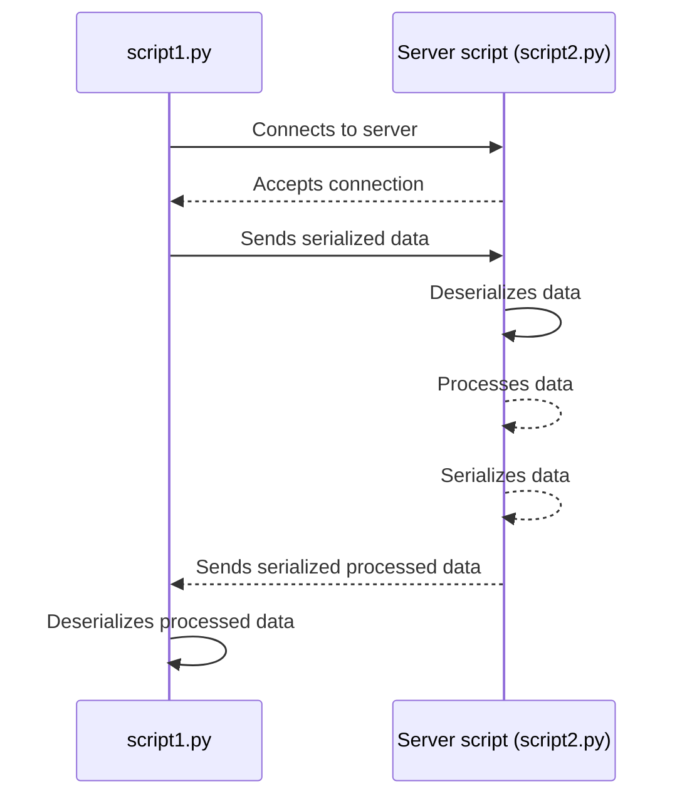

## Introduction
In the world of network programming, establishing communication between different scripts or applications is a common necessity. One powerful method to achieve this is through the use of sockets, and in the realm of Python, this becomes even more straightforward. In this blog post, we delve into the creation of a basic client-server interaction using Python scripts and explore the flow of data exchange between them.

Our focus revolves around two key artifacts: **script1.py** and **script2.py**. These scripts illustrate a fundamental client-server architecture where data is transmitted from the first script to the second, undergoes processing, and then returns to the initial script in a modified form.

Accompanying our exploration, we present a visual representation of the sequence of events using Mermaid, a powerful diagramming tool. This sequence diagram provides a clear and concise overview of the communication flow, highlighting the connection establishment, data transmission, processing, and the return of processed data.

Whether you're a beginner seeking to understand the basics of socket communication or an experienced developer looking for a quick reference, this blog post aims to provide insights into the fundamental concepts of building a simple client-server interaction in Python. Let's embark on this journey into the world of sockets and data exchange!

### Sequence Diagram
**Description and Discussion of the Sequence Diagram:**



The provided sequence diagram illustrates the step-by-step flow of communication between two Python scripts, namely **script1.py** and **script2.py**, employing a client-server architecture. Let's break down the key components and their interactions:

1. **Connection Establishment:**
    - _script1.py_ initiates the communication by connecting to the server (_script2.py_).
    - The server accepts the incoming connection, establishing a communication link.
2. **Data Transmission:**
    - _script1.py_ sends serialized data to the server. This data could represent any information that requires processing.
3. **Data Processing:**
    - The server (_script2.py_) receives the serialized data and proceeds to process it. This could involve various operations or transformations based on the specific requirements of the application.
4. **Return of Processed Data:**
    - Once the processing is complete, _script2.py_ sends the processed data back to _script1.py_.

This sequence of events encapsulates a fundamental client-server interaction. It's important to note that the sequence diagram provides a high-level overview, abstracting away details such as the actual data being transmitted or the specific processing logic applied by _script2.py_. The focus is on illustrating the flow of communication and the key stages in the interaction.

**Discussion Points:**
1. **Synchronous Communication:**
    - The diagram suggests a synchronous communication model, where _script1.py_ waits for a response from _script2.py_ after sending the data. This is typical in many client-server scenarios, but asynchronous models are also common in more complex systems.
2. **Data Serialization:**
    - The use of serialization (in this case, with Python's `pickle` module) facilitates the conversion of complex data structures into a format that can be easily transmitted over the network.
3. **Scalability and Robustness:**
    - While this example provides a foundational understanding, real-world applications often require considerations for error handling, security, and scalability. Implementing mechanisms for handling unexpected scenarios and securing the communication channel are crucial in production environments.
4. **Mermaid Sequence Diagram:**
    - The Mermaid sequence diagram serves as a visual aid, making it easier to comprehend the communication flow. It's a valuable tool for developers and architects to communicate and document the structure of a system.

The sequence diagram serves as a starting point for understanding the intricacies of socket communication in a simple client-server scenario. Further exploration and refinement of these concepts can lead to the development of more robust and sophisticated networked applications.

### First Script
Let's go over the first script:

```python
import socket
import pickle

data_structure = {'key': 'value', 'numbers': [1, 2, 3]}

# Serialize the data structure
serialized_data = pickle.dumps(data_structure)

# Send the serialized data to script2.py
with socket.socket(socket.AF_INET, socket.SOCK_STREAM) as s:
    s.connect(('localhost', 12345))
    s.sendall(serialized_data)

    # Receive the processed data from script2.py
    received_data = s.recv(4096)

# Deserialize and print the processed data
processed_data = pickle.loads(received_data)
print("Processed data received from script2.py:", processed_data)
```

1. **Data Structure Definition:**
    - A sample data structure (`data_structure`) is defined, consisting of a key-value pair and a list of numbers.
2. **Serialization:**
    - The `pickle.dumps()` method is used to serialize the `data_structure` into a binary format suitable for transmission over the network. The result is stored in the `serialized_data` variable.
3. **Socket Connection and Data Transmission:**
    - A socket (`s`) is created, and a connection is established with the server (assumed to be running _script2.py_) using `s.connect(('localhost', 12345))`.
    - The serialized data is sent to _script2.py_ using `s.sendall(serialized_data)`.
4. **Data Reception:**
    - The script waits to receive processed data from _script2.py_ using `s.recv(4096)`. The size parameter (4096) is often used to specify the maximum amount of data to be received at once.
5. **Deserialization and Output:**
    - The received data is deserialized using `pickle.loads(received_data)`, reconstructing the original data structure.
    - The processed data is printed to the console using `print("Processed data received from script2.py:", processed_data)`.

**Discussion Points:**
- **Serialization and Deserialization:**
    - The use of `pickle.dumps()` and `pickle.loads()` ensures that the data can be efficiently transmitted over the network in a serialized format and then reconstructed on the receiving end.
- **Socket Communication:**
    - The script utilizes the `socket` module to establish a connection and transmit data. It follows a client-side approach, connecting to a server running _script2.py_.
- **Network Considerations:**
    - The script assumes that the server is running locally on the same machine (`localhost`). In a real-world scenario, the connection details would be adapted based on the network configuration.
- **Data Processing:**
    - The script does not explicitly specify the nature of data processing performed by _script2.py_. The actual processing logic would depend on the requirements of the specific application.
This script serves as the client-side component of a client-server interaction, initiating the communication by sending serialized data to the server and subsequently receiving and processing the returned data.

### Second Script
And now let's go over script 2.

```python
import socket
import pickle

# Setup a socket to listen for incoming connections
with socket.socket(socket.AF_INET, socket.SOCK_STREAM) as s:
    s.bind(('localhost', 12345))
    s.listen()

    conn, addr = s.accept()
    with conn:
        print('Connected by', addr)

        # Receive the serialized data from script1.py
        serialized_data = conn.recv(4096)

        # Deserialize the data structure
        received_data = pickle.loads(serialized_data)

        # Process the data (for example, add 1 to each number in the list)
        processed_data = {'key': 'processed', 'numbers': [x + 1 for x in received_data['numbers']]}

        # Serialize and send the processed data back to script1.py
        serialized_processed_data = pickle.dumps(processed_data)
        conn.sendall(serialized_processed_data)
```

**Script Explanation:**
1. **Socket Setup and Listening:**
    - A socket is created and bound to the address `('localhost', 12345)` to listen for incoming connections.
    - The server enters a listening state using `s.listen()`.
2. **Accepting Connection:**
    - When _script1.py_ initiates a connection, the server accepts the incoming connection using `s.accept()`.
    - The `conn` variable represents the connection, and `addr` contains the address of the client.
3. **Data Reception and Deserialization:**
    - The server receives the serialized data from _script1.py_ using `conn.recv(4096)`.
    - The received data is deserialized using `pickle.loads(serialized_data)` to reconstruct the original data structure.
4. **Data Processing:**
    - The server processes the received data. In this example, it increments each number in the list by 1, creating a new `processed_data` dictionary.
5. **Serialization and Data Transmission:**
    - The processed data is serialized using `pickle.dumps(processed_data)`.
    - The serialized processed data is sent back to _script1.py_ using `conn.sendall(serialized_processed_data)`.

**Discussion Points:**
- **Connection Handling:**
    - The server uses `s.accept()` to accept incoming connections, and a new connection (`conn`) is created for further communication.
- **Serialization and Deserialization:**
    - Similar to the client script, the server uses `pickle` for serialization (`pickle.loads()`) and deserialization (`pickle.dumps()`).
- **Data Processing:**
    - The processing step in this example increments each number in the received list by 1. In a real-world scenario, this processing logic would be tailored to the specific requirements of the application.
- **Bi-directional Communication:**
    - The server not only receives data but also sends processed data back to the client. This bidirectional communication is a key characteristic of a client-server interaction.
- **Error Handling:**
    - The script lacks explicit error handling, and in a production environment, it's essential to incorporate robust error-handling mechanisms to address potential issues during communication.
These two scripts collectively represent a basic example of client-server communication in Python using sockets and serialization. Understanding the flow and interaction between the two scripts provides a foundation for building more complex networked applications.

## **Conclusion: Building a Foundation for Python Socket Communication**

In this exploration of Python socket communication, we've delved into the fundamentals of client-server interaction using two scripts: **script1.py** and **script2.py**. Our journey through the sequence diagram and script explanations has shed light on key concepts in network programming, emphasizing the orchestration of data exchange between these Python components.

**Key Takeaways:**
1. **Client-Server Architecture:**
    - The client-side script (_script1.py_) initiates communication by sending serialized data to the server (_script2.py_), which, in turn, processes the data and sends the results back to the client. This fundamental architecture enables the development of scalable and modular systems.
2. **Serialization and Deserialization:**
    - The use of the `pickle` module for serialization and deserialization ensures a seamless transformation of complex data structures into a format suitable for network transmission. This enables effective communication between scripts running on the same machine or across different nodes in a network.
3. **Socket Communication:**
    - Sockets provide the underlying infrastructure for communication, allowing for the establishment of connections and the transfer of serialized data between the client and server scripts.
4. **Sequence Diagram Visualization:**
    - The Mermaid sequence diagram served as a visual guide, illustrating the step-by-step flow of communication. It encapsulated the connection establishment, data transmission, processing, and the return of processed data.

**Considerations for Further Development:**
- **Error Handling and Robustness:**
    - Real-world applications demand robust error-handling mechanisms to gracefully manage unexpected scenarios, ensuring the reliability and stability of the communication process.
- **Security Measures:**
    - In production environments, considerations for securing the communication channel, such as implementing encryption and authentication mechanisms, become paramount.
- **Scalability:**
    - As the complexity of applications grows, designing for scalability becomes crucial. This involves optimizing communication protocols and architecture to handle increasing loads and diverse network conditions.

**Moving Forward:** This exploration provides a foundational understanding of Python socket communication, setting the stage for further exploration into advanced topics such as asynchronous communication, multi-threading, and integrating socket communication into larger applications. As you embark on your journey into network programming, these concepts will serve as a solid groundwork for building robust and efficient systems in Python. Happy coding!
