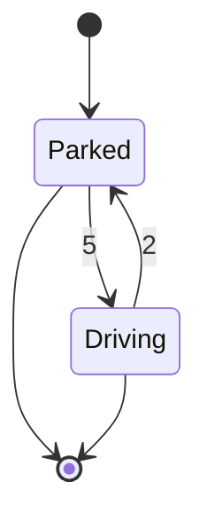

In the SimPy documentation they describe a [car process](https://simpy.readthedocs.io/en/latest/simpy_intro/basic_concepts.html#our-first-process) which involves a car which transitions between parking and driving. From being parked it takes 5 units of time to change to being in a state of driving. Similarly, it takes 2 units of time to go from being in a state of driving to a state of parkerd. Here is a state diagram representing this system:



For something this simple we don't really need discrete event simulation software, but it can be helpful for the sake of illustration to do it anyway. Let's use idiomatic Ciw to make an equivalent simulation.

Let our queueing network have two nodes, each representing either of the two states "Parked" or "Driving". The car will go between these two nodes. When the car arrives at a node that will repesent that it has begun the whatever process is involved, and when the car finishes service at that node we will interpret that to mean it is now changing state. 

Since there will be only one car in the whole network, we do not need to give any consideration to service discipline. If the car is on the queue, then serve it. Otherwise, don't.

We do need to pay attention to arrival times however. We need the car to arrive at the first node at the start of the simulation and for no additional cars to arrive thereafter. This can be achieved with a sequential distribution available in Ciw:

```python
ciw.dists.Sequential([0, float('inf')])
```

The class `ciw.dists.Sequential` takes an iterable (usually a list) representing the sequence of arrival times to be done. When it has gotten through the list it will start again at the start of the list. But here's the catch: we have set the second time to $\infty$, which it will never reach. So there will be a single arrival at $t=0$ and non thereafter. We need to specify that no arrivals occur at the second node, which we can do using `None`:

```python
arrival_dists = [ciw.dists.Sequential([0, float('inf')]), None]
```

For service times we know that the car will start driving after 5 units of time, then be parked for 2 units of time, and repeat. These are [constant random variables](https://en.wikipedia.org/wiki/Degenerate_distribution#Constant_random_variable) which can be specified in Ciw using `ciw.dists.Deterministic`:

service_dists = [ciw.dists.Deterministic(5), ciw.dists.Deterministic(2)]

We don't need to, but let's add some fluff so that we get a similar printout. To do that let's write a wrapper distribution.

```python
from typing import NoReturn

import ciw

class PrintDistWrapper(ciw.dists.Distribution):
    """
    A wrapper class for a probability distribution that adds a print statement
    before sampling from the underlying distribution.

    Parameters:
    - dist (ciw.dists.Distribution): The underlying probability distribution to be wrapped.
    - message (str): A custom message to be printed before sampling.

    Note: This class inherits from ciw.dists.Distribution.

    Example:
    ```
    underlying_dist = SomeDistributionClass(parameters)
    wrapper_dist = PrintDistWrapper(underlying_dist, "Sampling from the distribution:")
    sample_result = wrapper_dist.sample()
    ```
    """

    def __init__(self, dist: ciw.dists.Distribution, message: str) -> NoReturn:
        """
        Initialize the PrintDistWrapper instance.

        Parameters:
        - dist (ciw.dists.Distribution): The underlying probability distribution to be wrapped.
        - message (str): A custom message to be printed before sampling.
        """
        super().__init__()
        self.dist = dist
        self.message = message
            
    def sample(self, t: float = None, ind ciw.Individual = None) -> float:
        """
        Generate a sample from the underlying distribution, printing a custom message.

        Parameters:
        - t: Optional parameter (if applicable to the underlying distribution).
        - ind: Optional parameter (if applicable to the underlying distribution).

        Returns:
        - The sampled value from the underlying distribution.

        Note: This method overrides the sample method of ciw.dists.Distribution.
        """
        print(self.message, t)
        return self.dist.sample(t, ind)
```

The `PrintDistWrapper` class allows us to print whatever message we like when the distribution is sampled from. Now we can just wrap our service distributions like this:

```python
service_dists = [
  PrintDistWrapper(
    ciw.dists.Deterministic(5), 
    'Start parking at'), 
  PrintDistWrapper(
    ciw.dists.Deterministic(2), 
    'Start driving at')
    ]
```

We only need one server at each node since there could only ever be one car either there, or not there, requiring service. So we can just set those number of servers in a list like this:

```python
num_servers = [1, 1]
```

Since we have two nodes, we need to specifying the routing behaviour. It is simple in this case, and stationary. Whenever the car is leaving node one, go to node to. Whenever the car is leaving node two, go to node one. We can specify this as the following routing matrix:

$$\begin{bmatrix} 0 & 1 \\ 1 & 0 \end{bmatrix}$$

In Ciw we can take our routing matrix to be:

```python
R = [[0, 1], [1, 0]]
```

We can now put together our simulation object:

```python
network = ciw.create_network(
    arrival_distributions = arrival_dists,
    service_distributions = service_dists,
    number_of_servers = num_servers,
    routing=R
    )
```

And put together out simulation object:

```python
simulation = ciw.Simulation(network)
```

And simulate (for 15 units of time)!

```python
simulation.simulate_until_max_time(15)
```

Running all this, we get the expected printout:

```python
Start parking at 0
Start driving at 5
Start parking at 7
Start driving at 12
Start parking at 14
```

Happy simulating! :)
