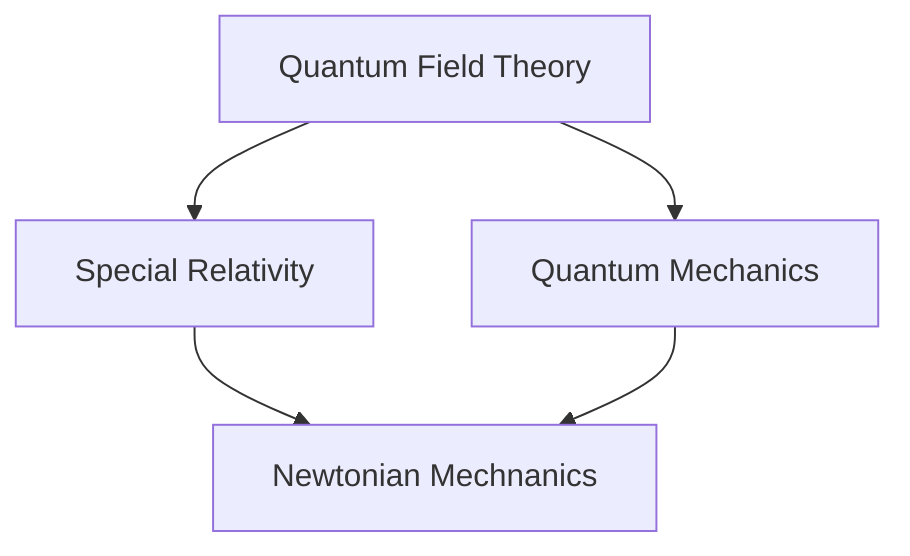

# The Big Picture

The following diagram points from more general frameworks toward more limited frameworks.

The following table shows that one of the ways that quantum field theory is different from these other frameworks is that it doesn't have particles in the same sense that the other frameworks do.

| Framework                            | Has Particles | Has Fields |
|--------------------------------------|---------------|------------|
| Newtoninan Mechanics                 | True          | True       |
| Special Relativity                   | True          | True       |
| (Non-Relativistic) Quantum Mechanics | True          | True       |
| Quantum Field Theory                 | False         | True       |

Another way to distinguish these frameworks is based on constraints for where they are predictive. The following table indicates which frameworks have particular constraints. Note that "False" means that the framework **does not** have the constraint, but also **does not** entail that the negation is a constraint. The first constraint is that the speed $\|v\|$ is substantially smaller than the speed of light $c$, denoted by $\|v\| << c$. The second constraint is that the action $S$ is substantially larger than $\frac{\hbar}{2}$, denoted $S >> \frac{\hbar}{2}$.

| Framework                            |$\|v\| << c$| $S >> \frac{\hbar}{2}$ |
|--------------------------------------|--------|-------------|
| Newtoninan Mechanics                 | True   | True        |
| Special Relativity                   | False  | True        |
| (Non-Relativistic) Quantum Mechanics | True   | False       |
| Quantum Field Theory                 | False  | False       |

In Flournoy's correspondence principles, general relativity is **not** a framework. A framework is a set of rules which can be applied on different physical forces (e.g. electromagnetism). A theory is a framework plus a set of degrees of freedom (i.e. the set of allowed set of particles and fields) plus their interactions (i.e. forces).

> It isn't clear to me how widely-accepted this distinction between a framework and theory is among physicists.
{: .prompt-warning}

# Comparison of Two Theories

Let us consider a comparison between electrodynamics and general relativity.

$$\nabla \cdot \vec E = \frac{\rho}{\epsilon_0}$$

$$\vec \nabla \times \vec B = \mu_0 ...$$

# Relativity & Symmetry

- Relativity: The laws of physics should take the same form to all inertial observers.
- Symmetry: 
  - [Isotropy](https://en.wikipedia.org/wiki/Isotropy) of space: rotational invariance
  - Homogeneity of space: invariance to translations in space
  - Homogeneity in time: invariance to translations in time
  
  
  
